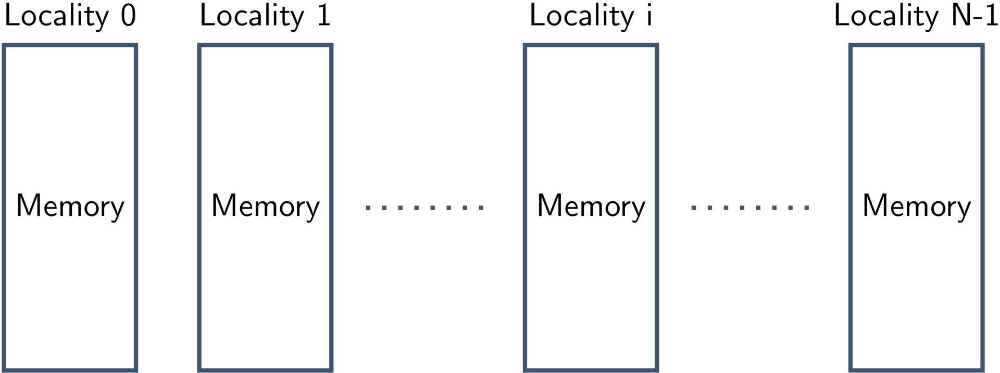
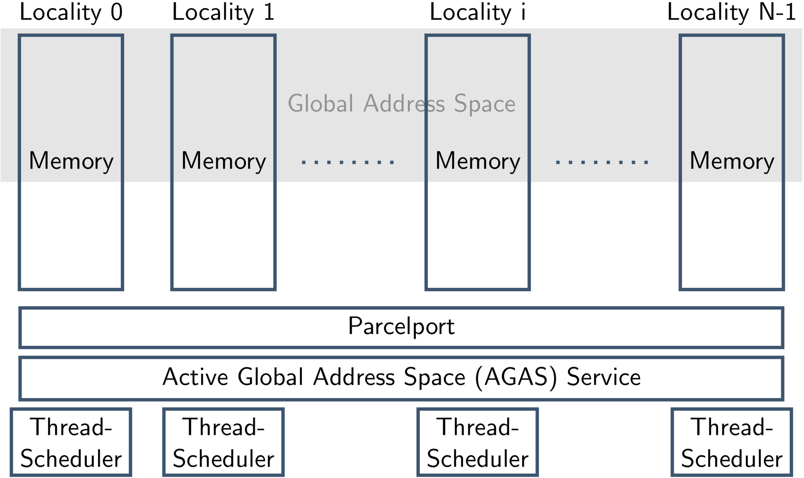
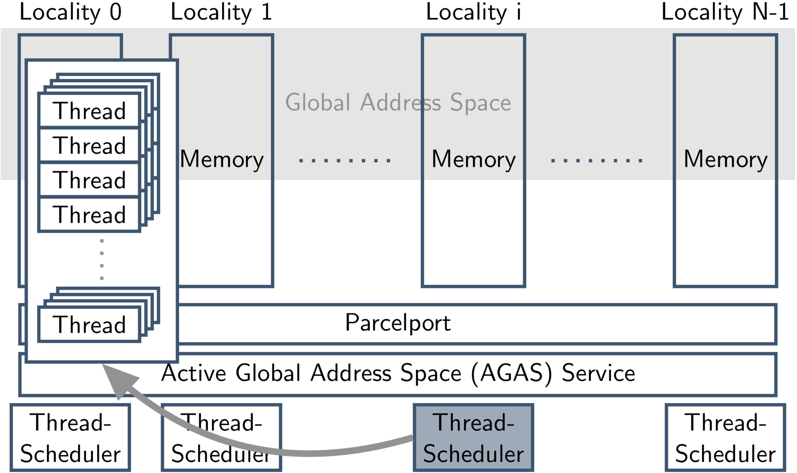
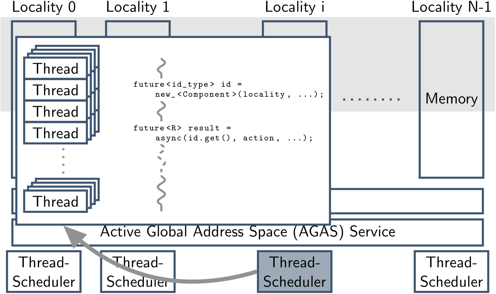
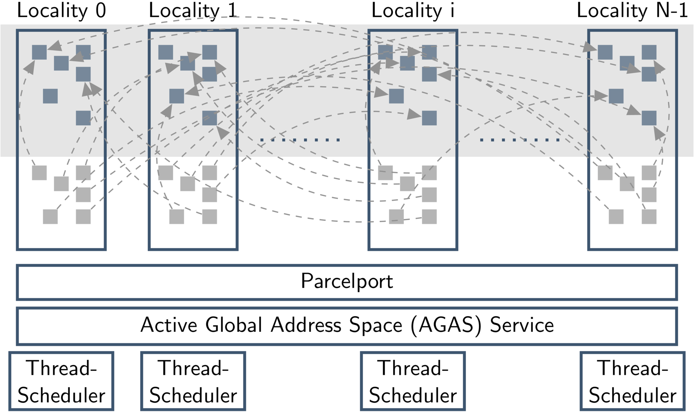

class: center, middle

# Introduction to HPX
## Part 2

[Overview](..)

Previous: [Introduction to HPX - Part 1](../session1)

???
[Click here to view the Presentation](https://stellar-group.github.io/tutorials/cscs2016/session2/)

---
## Recap: What's HPX

* Solidly based on a theoretical foundation – a well defined, new execution
  model (ParalleX)
* Exposes a coherent and uniform, standards-oriented API for ease of
  programming parallel and distributed applications.
    * Enables to write fully asynchronous code using hundreds of millions of threads.
    * Provides unified syntax and semantics for local and remote operations.
* Developed to run at any scale
* Compliant C++ Standard implementation (and more)
* Open Source: Published under the Boost Software License

---
## Recap: What's HPX

HPX represents an innovative mixture of

* A global system-wide address space (AGAS - Active Global Address Space)
* Fine grain parallelism and lightweight synchronization
* Combined with implicit, work queue based, message driven computation
* Full semantic equivalence of local and remote execution, and
* Explicit support for hardware accelerators (through percolation)

---
## The HPX Programming Model



---
## The HPX Programming Model



---
## The HPX Programming Model



---
## The HPX Programming Model



---
## The HPX Programming Model



---
## The HPX API
### Borrowed from the C++ Standard

Class                           | Description
--------------------------------|-----------------------------------
`hpx::thread`                   | Low level thread of control
`hpx::mutex`                    | Low level synchronization facility
`hpx::lcos::local::condition_variable`      | Signal a condition
`hpx::future`                   | Asynchronous result transport (receiving end)
`hpx::promise`, `hpx::lcos::local::promise` | Asynchronous result transport (producing end)
`hpx::lcos::packaged_task`      | Asynchronous result transport (producing end)
`hpx::async`                    | Spawning tasks (returns a future)
`hpx::bind`                     | Binding Parameters to callables
`hpx::function`                 | Type erased function object
`hpx::tuple`                    | Tuple
`hpx::any`                      | Type erased object (similar to `void*`)
`hpx::parallel::for_each`, etc. | Parallel Algorithms
`hpx::compute::vector`          | Continous storage for N elements

Extensions to the standards APIs where necessary, maintaining full compatibility.

---
## The HPX API
### Lightweight Control Objects (LCOs)

 * Objects to synchronize between different threads of execution.
 * Ability to suspend and reactivate Tasks
 * Examples:
    * `mutex`
    * `condition_variable`
    * `channel`
    * `promise`
    * `future`
    * `when_all`, `when_any`
    * ...
 * More on those later

---
## What is a (the) future?

A future is an object representing a result which has not been calculated yet

.left-column[

]

.right-column[
* Enables transparent synchronization with producer
* Hides notion of dealing with threads
* Makes asynchrony manageable
* Allows for composition of several asynchronous operations
* Turns concurrency into parallelism
]
---
## Diving into the Future -- The (basic) API

Functionality:

```
template <typename R>
class future
{
    // future constructors
    // Query the state
    // Waiting on the result
};

template <typename R>
class shared_future
{
    // Future constructors
    // Query the state
    // Waiting on the result
};
```
---
## Diving into the Future -- The (basic) API

Querying the state of the future

```
template <typename R>
class future
{
    // Future constructors
    // Construct an empty future.
    future();

    // Move a future to a new one
    future(future&& f);

    // Unwrap a future. The new future becomes ready when
    // the inner, and outer future are ready.
    explicit future(future<future>&& f);
    explicit future(shared_future<future>&& f);

    // Turn this future into a shared_future. Invalidates
    // the future!
    shared_future<T> share();

    // Query the state
    // Waiting on the result
};
```

---
## Diving into the Future -- The (basic) API

Querying the state of the future

```
template <typename R>
class future
{
    // Future constructors

    // Query the state

    // Check if the future is ready yet.
    bool is_ready();

    // Check if the future has a value
    bool has_value();

    // Check if the future has an exception
    bool has_exception();

    // Waiting on the result
};
```

---
## Diving into the Future -- The (basic) API

Waiting for the future to become ready
```
template <typename R>
class future
{
    // Future constructors
    // Query the state

    // Waiting on the result

    // Get the result. This function might block if the result has
    // not been computed yet. Invalidates the future!
    R get();

    // Attach a continuation. The function f gets called with
    // the (ready) future. Returns a new future with the result of
    // the invocation of f. Invalidates the future!
    template <typename F>
    auto then(F&& f);
};
```

---
## Example: SAXPY - The HPX Way

**Goal**: SAXPY routine with data locality

* `a[i] = b[i] * x + c[i]` for `i` from `0` to `N-1`
* Using parallel algorithms
* Explicit control over data locality
* No raw loops

---
## Example: SAXPY - The HPX Way

**Step 1**: Writing the serial version

.left-column[
```
std::vector<double> a = ...;
std::vector<double> b = ...;
std::vector<double> c = ...;
double x = ...;

std::transform(b.begin(),
  b.end(), c.begin(), a.begin(),
  [x](double bb, double cc)
  {
*   return bb * x + cc;
  }
);
```
]

.right-column[
* `bb` is `b[i]`
* `cc` is `c[i]`
* the calculated value gets written to `a[i]`
* [Complete code](https://github.com/STEllAR-GROUP/tutorials/tree/master/cscs2016/session2/saxpy/serial.cpp)
]

---
## Example: SAXPY - The HPX Way

**Step 2**: Parallelize it

.left-column[
```
std::vector<double> a = ...;
std::vector<double> b = ...;
std::vector<double> c = ...;
double x = ...;

*using hpx::parallel::par;
*hpx::parallel::transform(par
  b.begin(), b.end(), c.begin(),
  a.begin(),
  [x](double bb, double cc)
  {
    return bb * x + cc;
  }
);
```
]

.right-column[
* Replace the standard algorithm with a parallel one
* Set parallel exeuction policy
* [Complete code](https://github.com/STEllAR-GROUP/tutorials/tree/master/cscs2016/session2/saxpy/parallel.cpp)
]

---
## Example: SAXPY - The HPX Way

**Step 3**: Adding data locality

.left-column[
```
using hpx::compute::host;

typedef block_executor<>
    executor;
typedef block_allocator<double>
    allocator;

auto numa_domains = numa_nodes();
executor exec(numa_domains);
allocator alloc(numa_domains);

using hpx::compute::vector;

vector<double, executor> a = ...;
vector<double, executor> b = ...;
vector<double, executor> c = ...;
double x = ...;
```
]

.right-column[
```
*using hpx::parallel::par;
*auto policy = par.on(exec);
hpx::parallel::transform(
  policy, b.begin(),
  b.end(), c.begin(), a.begin(),
  [x](double bb, double cc)
  {
    return bb * x + cc;
  }
);
```
* Get targets for locality of data and execution
* Setup Executor and Allocator
* Run on the allocator
* [Complete code](https://github.com/STEllAR-GROUP/tutorials/tree/master/cscs2016/session2/saxpy/parallel_numa.cpp)
]

---
## Example: SAXPY - The HPX Way

**Optional Step**: Running it on the GPU

.left-column[
```
using hpx::compute::cuda;

typedef default_executor<>
    executor;
typedef allocator<double>
    allocator;

target device;
executor exec(device);
allocator alloc(device);

using hpx::compute::vector;

vector<double, executor> a = ...;
vector<double, executor> b = ...;
vector<double, executor> c = ...;
double x = ...;
```
]
.right-column[
```
*using hpx::parallel::par;
*auto policy = par.on(exec);
hpx::parallel::transform(
  policy, b.begin(),
  b.end(), c.begin(), a.begin(),
  [x] HPX_DEVICE
  (double bb, double cc)
  {
    return bb * x + cc;
  }
);
```
* Get targets for locality of data and execution
* Setup Executor and Allocator
* Run on the allocator
* [Complete code](https://github.com/STEllAR-GROUP/tutorials/tree/master/cscs2016/session2/saxpy/parallel_cuda.cpp)
* Works only for CUDA version 8 :(
]

---
class: center, middle
## Next Steps

[Building HPX and Applications](../session3)

[Running HPX Applications](../session4)
