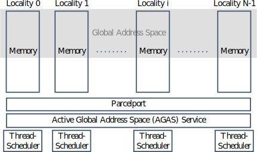
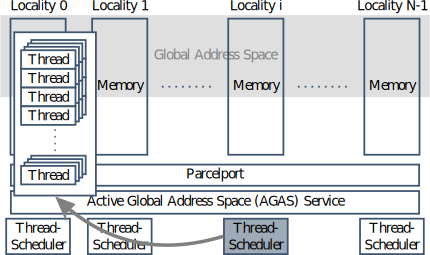
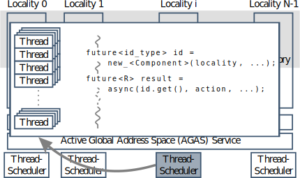
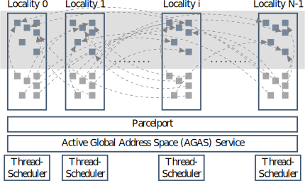
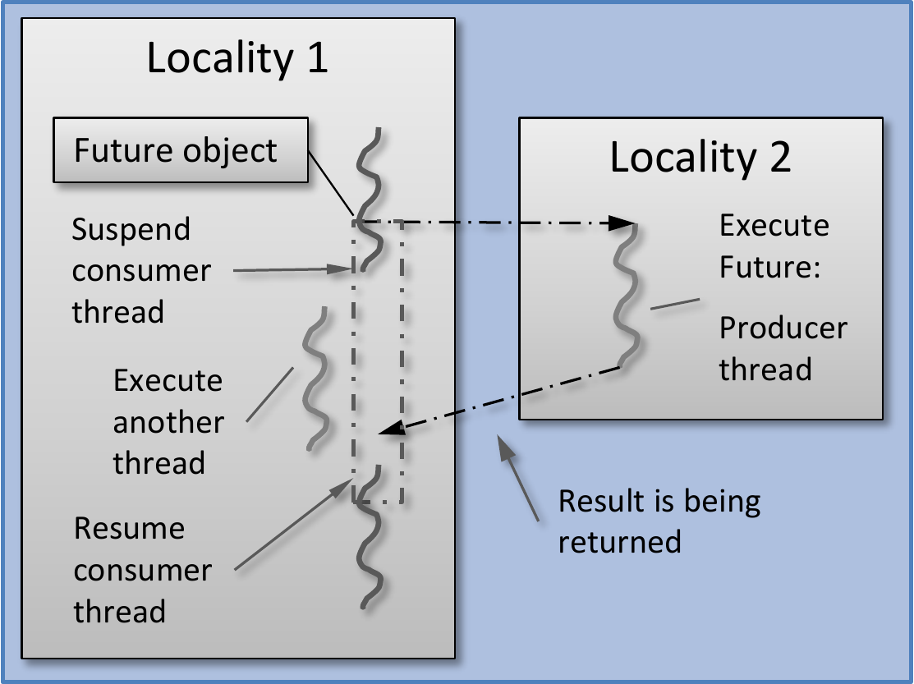

class: center, middle

# Introduction to HPX
## Part 2

Previous: [Introduction to HPX - Part 1](../session1)

---
## Recap: What's HPX

* Solidly based on a theoretical foundation – a well defined, new execution
  model (ParalleX)
* Exposes a coherent and uniform, standards-oriented API for ease of
  programming parallel and distributed applications.
    * Enables to write fully asynchronous code using hundreds of millions of threads.
    * Provides unified syntax and semantics for local and remote operations.
* Developed to run at any scale
* Compliant C++ Standard implementation (and more)
* Open Source: Published under the Boost Software License

---
## Recap: What's HPX

HPX represents an innovative mixture of

* A global system-wide address space (AGAS - Active Global Address Space)
* Fine grain parallelism and lightweight synchronization
* Combined with implicit, work queue based, message driven computation
* Full semantic equivalence of local and remote execution, and
* Explicit support for hardware accelerators (through percolation)

---
## The HPX Programming Model

---
## The HPX Programming Model

---
## The HPX Programming Model

---
## The HPX Programming Model

---
## The HPX Programming Model

.left[]

---
## What is a (the) future?

A future is an object representing a result which has not been calculated yet

.left-column[

]

.right-column[
* Enables transparent synchronization with producer
* Hides notion of dealing with threads
* Makes asynchrony manageable
* Allows for composition of several asynchronous operations
* Turns concurrency into parallelism
]
