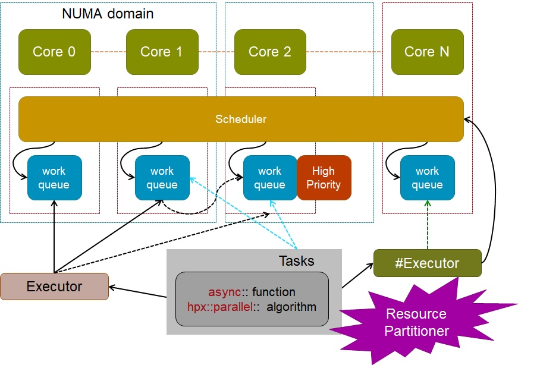

class: center, middle

# Introduction to HPX
## Part 1
## Overview of the HPX Framework/Runtime

[Overview](..)

---

# Topics to cover
### What are lightweight threads
* and how are they different from normal threads

### What do we mean by a "Runtime system/framework"
* the dividing line between OS and application

### How do you write/design "Task based" programs
* it requires rethinking of some codes

### Where does HPX stop and your code begin
* how deep into the internals should you go

#### Why is the HPX code repo so big and complicated
* and how do you find our way around it

---
## What about lightweight threads?
* It's the job of the operating system to manage 'hardware level' or 'kernel level' OS threads.

    * OS threads are expensive to create/destroy
    * OS threads take a timeslice of CPU time
    * Creating too many of them can hamper performance

* On Startup HPX creates one 'worker' thread per core

    * On each hardware thread, HPX runs its own Task Scheduler.

* HPX (Threads)/Tasks are executed on the HPX worker thread

    * which is really an OS thread
    * (you must be careful not to block the underlying thread - if you do,
    no tasks can run on it)
    * each HPX 'task' is referred to as a _lightweight thread_

* Wikipedia
    <span style="color:blue">
    "A thread of execution is the smallest sequence of programmed instructions that can
    be managed independently by a scheduler, which is typically a part of the
    operating system" </span>

---
##  Advantage of lightweight threads
* The philosophy behind lightweight threads is to switch from one task to another
as quickly as possible as soon as anything

    * finishes
    * needs to wait (suspend)

* Suspended tasks

    * Many tasks can run on the same worker thread (one after another)
    * or intermixed as one task suspends and another resumes

* HPX does not ever interrupt your task directly

    * the OS worker thread may be suspended as it loses its time slice
    * the HPX task running at the time is therefore suspended
    * other (dependent) tasks might in turn suspend

* Many small tasks are the key to sucess

    * with minimal dependencies on other tasks (if possible)
    * not too small (overheads of management), not too big (starvation of worker threads)
    * enough tasks in the queue helps ensure that no CPU cycles are wasted

---
## HPX runtime schematic
  <p align="center">
    
    
  </p>

---
## HPX runtime
* Similar to OpenMP/TBB, but ...

    * OpenMP has parallel regions where a thread pool executes your loops/tasks
    * outside those regions, code runs as usual (on normal 'OS threads')

* With HPX, the runtime is always active

    * the runtime is started on program startup
    * it stays active until program termination
    * there are no parallel regions
    * everything is running on an HPX thread
    * everything is part of a task

* Disclaimer

    * you can manually start/stop the runtime (if you really want to)
    * See example in tutorials

---
## HPX is a (only a) library
* It's implemented as a C++ library/framework

    * provides threads/futures/locks/schedulers/etc
    * allows the user to ignore the threads/schedulers/locks
    * gives the user control over them too

* The user doesn't manage threads directly (usually)

    * user creates tasks
    * synchronizes between/amongst them
    * shouldn't need to worry about low level synchronization primitives
    * (but sometimes needs to - see tutorial 'latency' example)
    * Threads can be 'managed' with special executors (e.g. OpenGL etc)

* The runtime does its best to schedule tasks

    * but it can be abused easily
    * either by accident (careless programming)
    * or deliberately

* A good understanding of how it all works really helps

---
## Synchonization with futures
* The principal means of synchronization in HPX is the `future<T>`

* A future is the result of something that hasn't yet run

* A future is set by one thread/task (directly, by using a promise)
    * using `promise.set_value(stuff);`
    * or by returing a value from a task such as `future<T> x = async(...)` call

* The value is retrieved by another thread/task
    * using `auto value = future.get();` syntax

* Futures in HPX are extended to support continuations
    * `future2 = future1.then(something_else);`

* And `when_xxx(one_or_more_futures)` syntax

* From these building blocks one can make complex DAGs

---
## Task based programming
* A different approach to writing your code
    * your program should be a tree of tasks
    * each task will depend on other tasks
    * and have child tasks
    * You don't have to have the same on all nodes (c.f. MPI)
<div class="crop">
    
</div>
* each one of these boxes will contain a sub-tree of (possibly millions) of tasks

---
## The goal with tasks
* Make these gaps as small as possible
    * Keep breaking tasks into smaller tasks so the scheduler can fill gaps
    * limit of task size/granularity is a function of overheads
        * context switch (actually swapping stack, registers etc)
        * time to create, queue, dequeue a task


---
## Bad tasks (or scheduling)
  <p align="center">
    
    
  </p>

---
## Good tasks
  <p align="center">
    
    
  </p>

---
## Task decomposition

* Breaking a program into tasks should be straightforward

* More functional
    * tasks should accept inputs and return results
    * modifying global state should be avoided
        * race conditions and other thread related problems (deadlocks etc)

* the leaf nodes of the tree are the smallest bits of work you can express
    * but those leaf nodes might be broken further by HPX
    * even `parallel::for(...)` loops decompose into tasks
    * all parallel::algorithm's are made up of tasks

* HPX differs from (most) other libraries because the same API and the same
scheduling/runtime can be used for the whole heirarchy of tasks

* We aim to replace OpenMP+MPI+Acc with a single framework
    * based soundly on C++
    * from top to bottom (of the task tree)

---
## Task scheduling and lifetime

* Each task goes onto one of the schedulers

    * where a task goes is controlled by executors

    * schedulers maintain a high priority and normal queue

    * schedulers can steal (some do, some don't)

    * you can choose a scheduler when you create an executor

* Tasks can be

    * Running : context is active, code is running as it would on native thread

    * Suspended : task ran, but then had to wait for something

    * Staged : task has been created, but cannot be run yet

    * Pending :it is ready to run, but waiting in a queue

    * Terminated : awaiting cleanup

---
## Suspended tasks
* A task that is running requires a value from a future

    * the future is not ready (:disappointed:)

    * `auto val = future->get()` would block (if we were not HPX)

    * the current task cannot progress so it changes state to _suspended_

    * the scheduler puts it into the suspended list

    * the future that was needed has the suspended task added to its internal
    (shared state) waiting list

    * when that future become ready, the task will be changed to _pending_

    * and go back onto the queue so that when a worker is free, it can run

* The same process happens when a task tries to take a lock but can't get it

    * The shared state inside the mutex will `notify` the task and do the 'right thing'

* This is one reason why all the `std::thread`, `std::mutex` etc code has been reimplemented

---
## Staged tasks
* Like a suspended task, but it hasn't run yet

* A staged task is what exists when a continuation or `when_xxx` creates a task
but it can't run until the dependencies are satisfied

* It's a suspended task that hasn't yet started

* When is the task actually created?
    * When the code that instantiates it is executed

    * Inside continuations this might be when another task completes
        * `future.then(another_task.then(more_tasks));`

    * Outside continuations it can be 'up-front'
        * a loop generating futures and attaching to previous iterations
            `future[i] = future[i-1].then(another_task);`
        * it can be confusing

    * Session tommorow (Resource management) will look again at this question

---
## Active Messages
* MPI uses send/receive
    * (it has one sided RMA too)
    * there is an implied synchronization between the endpoints

* HPX uses active messages
    * a remote function invocation + arguments
    * the arguments are the 'message' data

* A remote funtion invocation create a task on the remote node
    * the task goes into the queue of the remote node
    * it is no different to any other task
    * it might not have any relation to other tasks running there
    * it can synchronize with other tasks

* Channels
    * More about them later/tomorrow

---
## Structure of an application
* You can write an HPX application that only starts on locality 0
    * meaning `int main` runs on locality 0
        but other nodes just sit in a waiting loop
    * node 0 triggers a `do_work` action on remote nodes
    * how you coordinate these tasks is up to you

* You can run different binaries on differnt nodes
    * provising the `actions` on each node match up

* Different platforms on differnt nodes are supported
    * but unlikey to be used for most of our HPC codes

---
## Where does HPX end and your code start
* HPX has a runtime
* Everything is a task (at some level)
* HPX provides a parallel STL ... and parallel for etc

```
    auto range = boost::irange<std::size_t>(0, hpx::get_os_thread_count());
    //
    for_each(par.with(static_chunk_size())
      , std::begin(range), std::end(range)
        // For each element in the range, call the following lambda
      , [id](std::size_t num_thread)
        {
            std::cout
              << "Hello, I am HPX Thread " << num_thread
              << " executed on Locality " << id << std::endl;
            //
            compute_something_interesting();
        }
    );
```
* We are still writing C++, but how much is our code any more

---
## HPX is moving towards the future of C++
* HPX is implementing the proposals for concurrency and parallelism in c++

* What works and is successful will probably go into c++2x etc
    * what doesn't, will be subsumed into something else that does

    <br />
    <br />
    <br />

###"It's no use going back to yesterday, because I was a different person then."
Lewis Carroll, Alice in Wonderland

---
## A quick tour of the HPX resources

### HPX github repo
[https://github.com/STEllAR-GROUP/hpx](https://github.com/STEllAR-GROUP/hpx)<br />
Use the issue tracker to post your bug reports.
Look at the examples and unit tests to get ideas.

### HPX IRC channel
"You can get support via the #ste||ar IRC channels at freenode,
where you will often find knowledgeable people willing to help with
your problems and questions related to HPX."

### HPX mailing list
Subscribe and post your questions here hpx-users@stellar.cct.lsu.edu
(hardly anyone does, they use IRC and github issues)

### HPX Docs
[http://stellar-group.github.io/hpx/docs/html](http://stellar-group.github.io/hpx/docs/html)<br />
The best place to look for a first try

---
class: center, middle
## Next

[Introduction to HPX : Part 2](../session2)
