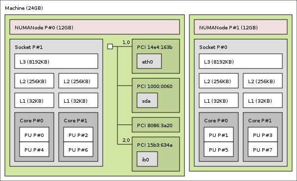
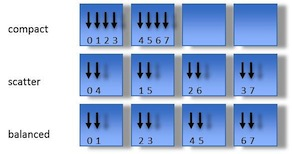

class: center, middle

# Building and running HPX applications
## Dependencies, HPX projects, command-line options

[Overview](..)

Previous: [Introduction to HPX - Part 2 (API)](../session2)

???
[Click here to view the Presentation](https://stellar-group.github.io/tutorials/cscs2019/session3/)

---
# Building HPX

* Can seem intimidating, but easier than it looks

---
## Dependencies

* Boost
* Hwloc
* A good allocator

---
## Dependencies #1
### Boost

HPX uses Boost extensively throughout the code
* Considerable amounts of boost code have been absorbed into HPX
    * so dependencies on boost are been gradually decreasing
    * (more `std::` features are present in newer compilers)

* Threading components, locks and mutexes
* Boost.context used for basis of lightweight threads
    * switching from one task to another
    * stack management etc
* Boost.program-options used for command line handling
* Boost.lockfree stacks and queues
* Boost.asio in startup code (TCP etc)
* Boost.preprocessor for lots of scary macros
* many boost utilities/algorithms all over the place

---
## Dependencies #2
### Portable Hardware Locality (hwloc)



* HPX needs to know what resources it is running on
* hwloc provides a mechanism for identifying numa domains, sockets, cores, GPUs
* HPX uses hwloc for thread pinning
    * at startup - and also in code
* startup binding : `--hpx:bind=compact/scatter/balanced`

---
## Dependencies #3
### jemalloc

"jemalloc is a general purpose malloc(3) implementation that emphasizes
    fragmentation avoidance and scalable concurrency support"

* TCMalloc may be used with very similar performance to jemalloc
    * (disclaimer: other memory managers exist)
* HPX is C++ - new/delete are used everywhere.
    * `vector<>/queue<>` and friends are used for storage inside the
    runtime, schedulers, parcelports
    * user tasks are likely to contain allocation of memory for objects

* built-in malloc is inefficient when used in multithreaded environments
* HPX compiled with jemalloc can be >10% faster then without
    * (subject to workload/algorithms implemented/used)

---
## Dependencies #4
### Profiling

* APEX downloaded as a dependency by the HPX build system
* OTF2 provides task plots, but needs to be enabled separately

---
## Compiling

* HPX module available on Piz Daint

    * `module load HPX`

* HPX contains toolchain files for several systems

    * Look in `hpx/cmake/toolchains`
    * Sets up most important options for that system

---
## Most important CMake options

```cmake
cmake \
 -DCMAKE_BUILD_TYPE=Release|RelWithDebInfo|Debug \
 -DCMAKE_INSTALL_PREFIX=/path/to/hpx/master/profiling \

 -DCMAKE_TOOLCHAIN_FILE=/path/to/source/hpx/cmake/toolchains/Cray.cmake \

 -DBOOST_ROOT=/path/to/boost/1.69.0 \
 -DHWLOC_ROOT=/path/to/hwloc/2.0.4 \
 -DHPX_WITH_MALLOC=jemalloc \
 -DJEMALLOC_ROOT=/path/to/jemalloc/5.2.0 \

 -DHPX_WITH_TESTS=ON|OFF \
 -DHPX_WITH_EXAMPLES=ON|OFF \

 -DHPX_WITH_PAPI=ON|OFF \
 -DHPX_WITH_APEX=ON|OFF \
 -DAPEX_WITH_PAPI=ON|OFF \
 -DAPEX_WITH_OTF2=ON|OFF \
 -DOTF2_ROOT=/path/to/otf2/2.0 \

 -DHPX_WITH_THREAD_IDLE_RATES=ON \

 /apps/daint/hpx/src/hpx
```

---
## Release vs Debug

* How much faster will a release build be compared to a debug one?

    * Lots faster

    * When building release mode, the compiler will inline all the function
    invocation code that is used by the template instantiations to specialize on
    different types etc.

    * Stack traces in debug mode can be 50-70 function calls deep

    * in release mode they might be only 5-7

    * nearly all of HPX is headers with extensive specializations of
    functions/algorithms and huge amounts of this are optimized away by the
    compiler in release mode

    * never profile anything in debug mode except for checking if you made it
    faster or slower than the previous test
    
---
## Building tips #1

* Building _all_ of HPX can take a long time
    * 700 tests
    * 100 examples

* On your first build, enable `HPX_WITH_EXAMPLES` and `HPX_WITH_TESTS`
    * `make -j8 hello_world_1`
    * check it compiles
    * check it runs

* If hello world is ok, then build the rest (at your discretion)
    ```sh
    make tests.unit tests.regression examples
    ```
* Use `make help` to dump out a list of targets

* Aside: it will be possible to build only selected parts of HPX in the next few
  releases, e.g. only single-node features

* Run tests
```sh
ctest -R tests.unit
```

* Note that some tests run distributed so you need to first allocate some nodes
to ensure that MPI works
```sh
salloc -N 2
```

---
## Building tips #2

* Note: `make -j8 xxx` can cause problems
    * HPX uses a _lot_ of templates and the compiler can use all your memory
    * if disk swapping starts during compiling use `make -j2` (or `j4` etc)

---
## Building tips #3

* __Use a released version of HPX__
    * We aim to release a new version every 6 months

* HPX is a changing target as many commits are being made daily

* You may find bugs [cue laughter] and submit issues to the github tracker

* When they are fixed (often quickly) you will want to pull the changes

* You need to maintain a good synchronization between your HPX build and your
test project build

---
## Main HPX build options #1

* General format is `HPX_WITH_FEATURE_X`
    * if `FEATURE_X` is available and working, then in the code you get
    `#define HPX_HAVE_FEATURE_X`
    * in build dir, config `#defines` written `<hpx/config/defines.hpp>`

* All options are documented on [this page of HPX build
options](https://stellar-group.github.io/hpx/docs/sphinx/latest/html/manual/building_hpx.html#cmake-variables-used-to-configure-hpx)

---
## Main HPX build options #2

* Generic options
    * `HPX_WITH_CUDA`: Enables latest features to interface with GPUs using CUDA.
    * `HPX_WITH_GENERIC_CONTEXT_COROUTINES`: when ON, uses Boost.context for
    lightweight threads, otherwise some platform provided library
    * `HPX_WITH_LOGGING`: when enabled can produce huge amounts of debug info
    * `HPX_WITH_NATIVE_TLS`: Thread local storage, turn on unless on Xcode<8
    * `HPX_WITH_PARCEL_COALESCING`: gathers messages together when they can't be
      sent immediately
    * `HPX_WITH_RUN_MAIN_EVERYWHERE`: when on, main is called on all localities,
    when off, only root has int main called - to be discussed further
    * `HPX_WITH_VC_DATAPAR`: latest SIMD code option using Vc library

---
## Main HPX build options #3
* Thread options
    * `HPX_WITH_STACKTRACES`: Shows you where your exception was thrown in debug
      mode
    * `HPX_WITH_THREAD_BACKTRACE_ON_SUSPENSION`: When tasks are suspended,
    capture a backtrace for debugging.
    * `HPX_WITH_THREAD_CREATION_AND_CLEANUP_RATES`,
    `HPX_WITH_THREAD_CUMULATIVE_COUNTS`, `HPX_WITH_THREAD_QUEUE_WAITTIME`,
    `HPX_WITH_THREAD_STEALING_COUNTS`, `HPX_WITH_THREAD_IDLE_RATES`: performance
    counters for threading subsytem - Enable measuring the percentage of
    overhead times spent in the scheduler
    * `HPX_WITH_THREAD_LOCAL_STORAGE`: On everywhere except OSX pre Xcode 8
    * `HPX_WITH_THREAD_MANAGER_IDLE_BACKOFF`: Performance tweaking - HPX
    scheduler threads are backing off on idle queues
    * `HPX_WITH_THREAD_SCHEDULERS`: enable different thread schedulers - Options
    are: all, abp-priority, local, shared-priority, static-priority, and static.

---
## Main HPX build options #4

* Parcelport options
    * `HPX_WITH_PARCELPORT_MPI`: Yes
    * `HPX_WITH_PARCELPORT_MPI_ENV`: allows you to control the Env vars used to
    detect nodes etc
    * `HPX_WITH_PARCELPORT_MPI_MULTITHREADED`: Yes
    * `HPX_WITH_PARCELPORT_TCP`: depends, but usually Yes
    * `HPX_WITH_PARCEL_PROFILING`: (still under development), but will give
    details about parcel traces/dependencies to help with profiling

---
# Building HPX projects

* Building HPX projects straightforward with the help of a few functions
  provided by HPX

---
## HPX project: CMakeLists.txt

Main requirement of `CMakeLists.txt` is

``` cmake
find_package(HPX REQUIRED)
```

``` cmake
add_hpx_executable(target SOURCES source.cpp
  [COMPONENT_DEPENDENCIES iostreams]
  [DEPENDENCIES another_lib])
```

---
## HPX project: CMakeLists.txt

Alternatively, for existing targets:

``` cmake
hpx_setup_target(target
  [COMPONENT_DEPENDENCIES iostreams]
  [DEPENDENCIES another_lib])
```

You can still add other dependencies:

```cmake
target_link_libraries(
  target
  a_third_lib
)
```

---
# Hello World!
## Options and running applications

* HPX applications can be started in a few different ways
* HPX comes with a large set of options you can pass through the command line
* We will cover a few
* [Read the docs!](http://stellar-group.github.io/hpx/docs/sphinx/latest/html/index.html)

---
## HPX Application Startup
### `hpx::init`

```
#include <hpx/hpx_init.hpp>

int hpx_main()
{
	// Initiate HPX shutdown
	return hpx::finalize()
}

int main(int argc, char** argv)
{
	hpx::init(argc, argv);
}
```

---
## HPX application startup
### Alternative "replacing" main

* Alternative for providing `hpx_main` and calling `hpx_init`
* The HPX runtime gets set up in the background
* The application still accepts all regular HPX parameters

```
#include <hpx/hpx_main.hpp>

int main()
{
	return 0;
}
```

or:

```
#include <hpx/hpx_main.hpp>

int main(int argc, char** argv)
{
	return 0;
}
```

---
## Adding your own options
### Use C-style main

```
#include <hpx/hpx_init.hpp>

// Use regular "C-style-main" and parse non-consumed command line arguments
int hpx_main(int argc, char** argv)
{
	// Initiate HPX shutdown
	return hpx::finalize()
}
```

---
## Adding your own options
### Using Boost.ProgramOptions

```
#include <hpx/hpx_init.hpp>

// Use Boost.ProgramOptions to retrieved non-consumed command line arguments
int hpx_main(boost::program_options::variables_map& vm)
{
    std::size_t Nx = vm["Nx"].as<std::size_t>();
	return hpx::finalize()
}

int main(int argc, char** argv)
{
    using namespace boost::program_options;

    options_description desc_commandline;
    desc_commandline.add_options()
        ("Nx", value<std::uint64_t>()->default_value(1024),
         "Elements in the x direction")
	hpx::init(desc_commandline, argc, argv);
}
```
* [Read the docs!](http://www.boost.org/doc/libs/release/doc/html/program_options.html)

---
## Adding your own options
### Using The HPX INI Config

```
#include <hpx/hpx_init.hpp>

int hpx_main()
{
	std::string val = hpx::get_config_entry("my.cool.option", "42");

	return hpx::finalize()
}

int main(int argc, char** argv)
{
    // Initialize and run HPX, this example requires to run hpx_main on all
    // localities. And an application specific setting
    std::vector<std::string> const cfg = {
        "hpx.run_hpx_main!=1",
        "my.cool.option!=yeha"
    };

    return hpx::init(argc, argv, cfg);
}
```

* Can be combined with an application specific `options_description` as well!

---
## Overview
### Command line parameters

```INI
$ ./bin/hello_world_1 --hpx:help

Usage: unknown HPX application [options]:

HPX options (allowed on command line only):
  --hpx:help [=arg(=minimal)]           print out program usage (default: this
                                        message), possible values: 'full'
                                        (additionally prints options from
                                        components)
  --hpx:version                         print out HPX version and copyright
                                        information
  --hpx:info                            print out HPX configuration information
  --hpx:options-file arg                specify a file containing command line
                                        options (alternatively: @filepath)

HPX options (additionally allowed in an options file):
  --hpx:run-agas-server                 run AGAS server as part of this runtime
                                        instance
  --hpx:run-hpx-main                    run the hpx_main function, regardless
                                        of locality mode

... And much more ...
```

---
## Overview
### The HPX INI Config

```INI
$ ./bin/hello_world --hpx:dump-config
Configuration after runtime start:
----------------------------------
============================
  [application]
  [hpx]
    'affinity' : 'pu'
    'bind' : 'balanced'
    'cmd_line' : './bin/hello_world --hpx:dump-config'
    'component_path' : '$[hpx.location]:$[system.executable_prefix]' -> '/apps/daint/hpx/0.9.99/gnu_530/debug:/users/heller/tutorials/examples/build/debug'
    'component_path_suffixes' : '/lib/hpx:/bin/hpx'
    'cores' : '1'
    'expect_connecting_localities' : '1'
    'finalize_wait_time' : '-1.0'
    'first_pu' : '0'

... And much more ...
```
* Can be set with `-I...`/`--hpx:ini`
	* Example: `-Ihpx.bind=compact`
* Or `--hpx:config=/path/to/hpx.ini`

---
## Version Information
### `--hpx:version`

```
$ ./bin/hello_world_1 --hpx:version

HPX - The C++ Standard Library for Parallelism and Concurrency
(A general purpose parallel C++ runtime system for distributed applications
of any scale).

Copyright (c) 2007-2019, The STE||AR Group,
http://stellar-group.org, email:hpx-users@stellar.cct.lsu.edu

Distributed under the Boost Software License, Version 1.0. (See accompanying
file LICENSE_1_0.txt or copy at http://www.boost.org/LICENSE_1_0.txt)

Versions:
  HPX: V1.4.0-trunk (AGAS: V3.0), Git: b692046feb
  Boost: V1.67.0
  Hwloc: V2.0.0

Build:
  Type: release
  Date: Jan  1 1970 00:00:01
  Platform: linux
  Compiler: GNU C++ version 9.1.0
  Standard Library: GNU libstdc++ version 20190503
  Allocator: tcmalloc
```

---
## Controlling CPU binding
### General

* Use `--hpx:print-bind` to show the selected bindings
* Use `--hpx:threads=N` to select the number of threads per locality
* Use `--hpx:cores=N` to select the number of cores

---
## Controlling CPU binding
### Binding the HPX worker threads to specific CPU Cores

.left-column[
* `--hpx:bind=...`
    * `compact`
    * `scatter`
	* `balanced`
	* _description_
]
.right-column[

]

---
## Controlling CPU binding
### Binding the HPX worker threads to specific CPU Cores

* Bind Description:

.left-column[
```
mappings:
    distribution
    mapping(;mapping)*

distribution:
    'compact'
    'scatter
    'balanced'

mapping:
    thread-spec=pu-specs

thread-spec:
    'thread':range-specs

pu-specs:
    pu-spec(.pu-spec)*
```
]
.right-column[

```

pu-spec:
    type:range-specs
    ~pu-spec

range-specs:
    range-spec(,range-spec)*

range-spec:
    int
    int-int
    'all'

type:
    'socket' | 'numanode'
    'core'
    'pu'
```
]

---
## Controlling CPU binding
### Binding the HPX worker threads to specific CPU Cores

* Use `lstopo` to get an idea of your CPU topology
* Bind Description, Examples:

```
# 4 worker threads, running on the first 4 CPUs using the first Hyperthread
$ ./bin/hello_world --hpx:threads=4 --hpx:print-bind \
	--hpx:bind="thread:0-3=core:0-3.pu:0"
****************************************************************
locality: 0
   0: PU L#0(P#0), Core L#0(P#0), Socket L#0(P#0), Node L#0(P#0)
   1: PU L#1(P#2), Core L#1(P#1), Socket L#0(P#0), Node L#0(P#0)
   2: PU L#2(P#4), Core L#2(P#2), Socket L#0(P#0), Node L#0(P#0)
   3: PU L#3(P#6), Core L#3(P#3), Socket L#0(P#0), Node L#0(P#0):
```

```
# 4 worker threads, running on the first 2 run on NUMA domain 0, using the second
# and third core, worker thread 3 runs on the second NUMA on the 7th core, worker
# thread 4 on the 2nd NUMA and 8th worker core, using the first Hyperthread
$ ./bin/hello_world --hpx:threads=4 --hpx:print-bind \
	--hpx:bind="thread:0-1=socket:0.core:0-2.pu:0;thread:2-3=socket:1.core:6-7.pu:0"
****************************************************************
locality: 0
   0: PU L#0(P#0), Core L#0(P#0), Socket L#0(P#0), Node L#0(P#0)
   1: PU L#1(P#2), Core L#1(P#1), Socket L#0(P#0), Node L#0(P#0)
   2: PU L#13(P#11), Core L#13(P#5), Socket L#1(P#1), Node L#1(P#1)
   3: PU L#14(P#13), Core L#14(P#6), Socket L#1(P#1), Node L#1(P#1)
```

---
## Controlling CPU binding
### Using process mask from `numactl`, `mpirun`, etc.

* The command-line option `--hpx:use-process-mask` will use whatever mask you have
set up for the process.
    * Available in the next release (November)

---
## Distributed Runs
### General

* HPX itself doesn't come with a dedicated launcher (like `mpirun`)
	* `--hpx:localities=N`: using N localities
	* `--hpx:locality=i`: ith locality
	* `--hpx:agas=host`: The root (locality 0) process host
	* `--hpx:hpx=host`: The host this HPX process is listening on
* Manual setup tedious:
	* Start N processes, set correct parameters...

---
## Distributed Runs
### `hpxrun.py`

* Small wrapper script to allow easy setup for distributed runs:

```
  -h, --help            show this help message and exit
  -l LOCALITIES, --localities=LOCALITIES
                        Number of localities to run (environment variable
                        HPXRUN_LOCALITIES
  -t THREADS, --threads=THREADS
                        Number of threads per locality (environment variable
                        HPXRUN_THREADS)
  -p PARCELPORT, --parcelport=PARCELPORT
                        Which parcelport to use (Options are: ibverbs, ipc,
                        mpi, tcp) (environment variable HPXRUN_PARCELPORT
  -r RUNWRAPPER, --runwrapper=RUNWRAPPER
                        Which runwrapper to use (Options are: none, mpi, srun)
                        (environment variable HPXRUN_ (environment variable
                        HPXRUN_RUNWRAPPER)
  -e EXPECTED, --expected=EXPECTED
                        Expected return codes of all invoked processes
                        (environment variable HPXRUN_EXPECTED)
  -v, --verbose         Verbose output (environment variable HPXRUN_VERBOSE)

```

---
## Batch environments
### General

* The HPX startup routines can detect batch systems
* Extracts the needed information to setup the application:
	* Number of threads
	* Number of localities
	* Host names
* Supported environments: SLURM, PBS, ALPS, MPI

---
## Batch environments
### SLURM

* HPX startup parses the various environment variables set by SLURM:
	* Number of nodes to use
	* Number of threads to use
	* List of nodes of the allocation
* Use `salloc` to get an allocation, `srun` to start the application
* Useful parameters
	* `-n`: Number of processes
	* `-N`: Number of nodes to distribute processes on
	* `-c`: Number of cores
	* `--hint=nomultithread`: Turn off multithreading

---
## Batch environments
### ALPS

* Similar to SLURM
* qsub -I -X -lnodes=1:ppn=24,walltime=1:00:00 -q R_course
* aprun -n 1 -N 1 -d 24 ./my_prog
    * -n determines the number of nodes
    * -N The number of localities per node
    * -d The number of cores to use

---
## Batch environments
### MPI

Note: The following only applies if you have the MPI parcelport compiled in

* Just use mpirun to start your distributed Application, we will use the number
 of ranks, and the rank to communicate with MPI routines.
* Read the documentation of your Supercomputer on how to launch MPI
 jobs.
* You usually want one process (==locality) per node!
* Note to Cray users:
	* If you have SLURM on your cray, srun will automatically activate MPI
	* If using plain ALPS, aprun has the same effect

---
## Distributed Runs
### Selecting parcelports

* `--hpx:list-parcel-ports`: Lists which parcelports are available and enabled
* Use the INI configuration to explicitly disable/enable Parcelports:
	* `-Ihpx.parcel.tcp.enable=0` will disable the TCP parcelport

---
## Debugging options

* Attach a debugger:
	* `--hpx:attach-debugger`: This will stop the HPX application and wait for
		the debugger to be attached and the application being continued
	* `--hpx:attach-debugger=exception`: Stops the application if there was an
		exception
* Logging:
	* `--hpx:debug-hpx-log`
* Debug command line parsing:
	* `--hpx:debug-clp`

---
## Performance Counters

* List all available performance counters:
	* `--hpx:list-counters`
* Print counter:
	* `--hpx:print-counter counter`
	* This will print the counter once the application has been completed
* Set counter interval:
	* `--hpx:print-counter-interval time`
* Print performance counters from your application:
	* `hpx::evaluate_active_counters(bool reset, char const* description)`

---
## Apex trace output

* To generate trace files compatible with Vampir etc.
```sh
export APEX_OTF2=1
export APEX_PROFILE=1
export APEX_SCREEN_OUTPUT=1
```
*   OTF2 trace files generated by the OTF2 library

---
## Next

[Exercises](../session4)
