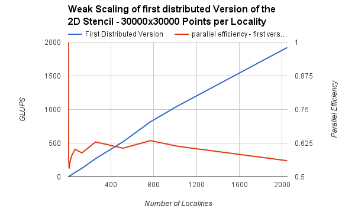
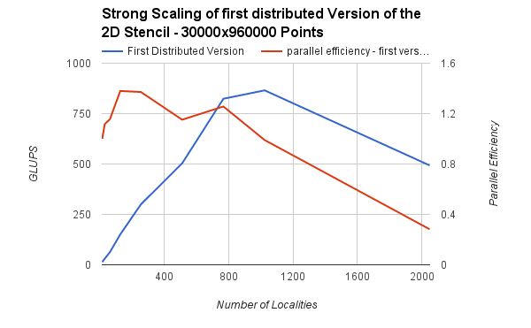
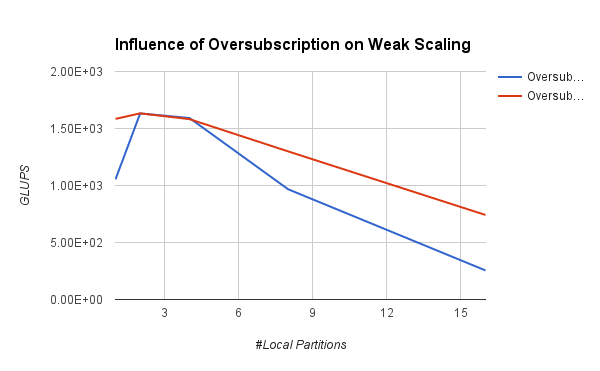
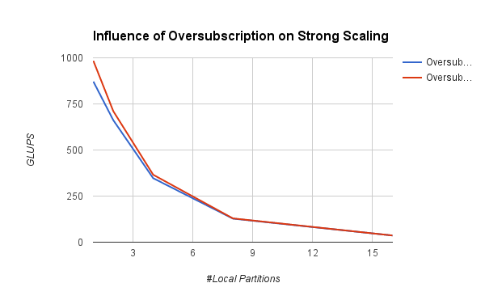
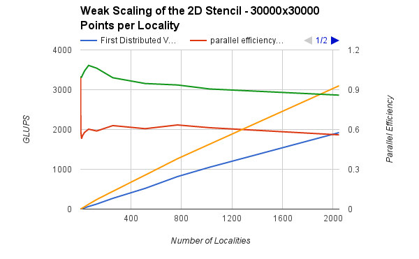
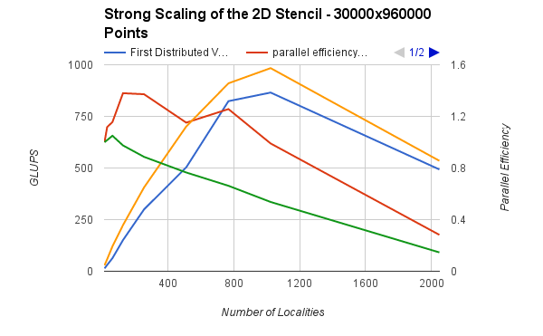

class: center, middle

# Debugging and profiling HPX applications

[Overview](..)

Previous: [Worked 2D Stencil Example](../session5)

???
[Click here to view the Presentation](https://stellar-group.github.io/tutorials/cscs2019/session6/)

---
## Topics covered

* Debugging Compile Time Errors
* Debugging Runtime Errors
* Performance Problems

---
## Revisiting the Stencil
### How well does it scale?

  
[Raw Data](https://docs.google.com/spreadsheets/d/14e9B92e9USF03kFlKlxUzVf_Ctm05nMoayTzchybY_8/edit?usp=sharing)

---
## Revisiting the Stencil
### How well does it scale?

  
[Raw Data](https://docs.google.com/spreadsheets/d/14e9B92e9USF03kFlKlxUzVf_Ctm05nMoayTzchybY_8/edit?usp=sharing)

---
## Revisiting the Stencil
### Improvements

* [The importance of Oversubscription]()
* [Having more than one Partition per Locality]()
* [Futurization - Waiting is losing]()

---
# Revisiting the Stencil
### Influence of Oversubscription

  
[Raw Data](https://docs.google.com/spreadsheets/d/14e9B92e9USF03kFlKlxUzVf_Ctm05nMoayTzchybY_8/edit?usp=sharing)

---
# Revisiting the Stencil
### Influence of Oversubscription

  
[Raw Data](https://docs.google.com/spreadsheets/d/14e9B92e9USF03kFlKlxUzVf_Ctm05nMoayTzchybY_8/edit?usp=sharing)

---
## Revisiting the Stencil
### How well does it scale now?

  
[Raw Data](https://docs.google.com/spreadsheets/d/14e9B92e9USF03kFlKlxUzVf_Ctm05nMoayTzchybY_8/edit?usp=sharing)

---
## Revisiting the Stencil
### How well does it scale now?

  
[Raw Data](https://docs.google.com/spreadsheets/d/14e9B92e9USF03kFlKlxUzVf_Ctm05nMoayTzchybY_8/edit?usp=sharing)

---
class: center, middle
## Next

 [Resource Management and Performance Issues](../session7)

