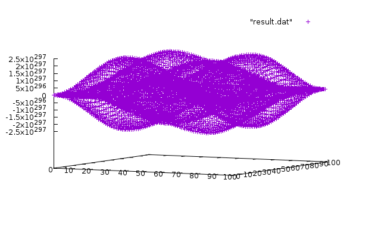

class: center, middle

# Worked 2D Stencil Example
## From Serial to Distributed

[Overview](..)

Previous: [Hello World! - Options and Running Applications](../session4)

???
[Click here to view the Presentation](https://stellar-group.github.io/tutorials/cscs2016/session5/)

---
## The Problem we want to solve
### "Solving" a PDE on a 2D Grid

* DISCLAIMER: This has no real physics or mathematical background. Left as an excercise for the reader ;)

.left-column[

]

.right-column[
* Running a 5 point stencil on each element: <br/>
  `new(x,y) = 0.25 * (old(x-1,y+1) + old(x+1,y+1) + old(x-1,y-1) + old(x-1,y+1)) - old(x,y)`
* Boundaries are a constant `1`
* High-Level Modern C++
]

---
## Modeling the Stencil in C++
### Memory structure

* Goal: Store Grid as `std::vector<double>`


---
## Modeling the Stencil in C++
### Memory structure

* Goal: Store Grid as `std::vector<double>`


---
## Modeling the Stencil in C++
### Memory structure

* Goal: Store Grid as `std::vector<double>`


---
## Modeling the Stencil in C++
### Iterating the Grid: Applying the stencil

* We want to update line by line
* Each line needs its upper and lower neighbor


--
```
template <typename InIter, typename OutIter>
OutIter line_update(InIter begin, InIter end, OutIter result)
{
    ++result;
    // Iterate over the interior: skip the last and first element
    for(InIter it = begin + 1; it != end - 1; ++it, ++result)
    {
        *result = 0.25 * (it.up[-1] + it.up[+1] + it.down[-1]  + it.down[+1])
            - *it.middle;
    }
    ++result;

    return result;
}
```

---
## Modeling the Stencil in C++
### Iterating the Grid: Designing the Iterator

* Feasible to make it hierarchical:
    * One iterator that "moves" in y-Direction (row wise) <br/>
        `row_iterator`
    * One iterator that "moves" in x-Direction (operates on a line) <br/>
        `line_iterator`

---
## Modeling the Stencil in C++
### Iterating the Grid: The Line Iterator

```
template <typename UpIter, typename MiddleIter, typename DownIter>
struct line_iterator
{
    UpIter up;
    MiddleIter middle;
    DownIter down;

    void increment() {
        ++up;
        ++middle;
        ++down;
    }

    void decrement() {
        --up;
        --middle;
        --down;
    }

    void advance(std::ptrdiff_t n) {
        up += n;
        middle += n;
        down += n;
    }
};
```

---
## Modeling the Stencil in C++
### Iterating the Grid: The Line Iterator, make it a proper iterator

```
template <typename UpIter, typename MiddleIter, typename DownIter>
struct line_iterator
    // iterator_facade is a facade class that defines the boilerplate needed for
    // a proper standard C++ iterator.
  : hpx::util::iterator_facade<
        // Our type:
        line_iterator<UpIter, MiddleIter, DownIter>,
        // Value type (When dereferencing the iterator)
        double,
        // Our iterator is random access.
        std::random_access_iterator_tag>
{
    // <snip>

    bool equal(line_iterator const& other) const {
        return middle == other.middle;
    }

    typename base_type::reference dereference() const {
        return *middle;
    }

    std::ptrdiff_t distance_to(line_iterator const& other) const {
        return other.middle - middle;
    }
};
```

* [Complete code](https://github.com/STEllAR-GROUP/tutorials/tree/master/examples/02_stencil/line_iterator.hpp)


---
## Modeling the Stencil in C++
### Iterating the Grid: The Row Iterator

```
template <typename UpIter, typename MiddleIter, typename DownIter>
struct row_iterator
    // iterator_facade is a facade class that defines the boilerplate needed for
    // a proper standard C++ iterator.
  : hpx::util::iterator_facade<
        // Our type:
        row_iterator<UpIter, MiddleIter, DownIter>,
        // Value type (When dereferencing the iterator)
        line_iterator<UpIter, MiddleIter, DownIter>,
        // Our iterator is random access.
        std::random_access_iterator_tag,
        // Since dereferencing should return a new line_iterator, we need to
        // explicitly set the reference type.
        line_iterator<UpIter, MiddleIter, DownIter>
    >
{
    typedef line_iterator<UpIter, MiddleIter, DownIter> line_iterator_type;

    row_iterator(std::size_t Nx, MiddleIter middle_)
      : up_(middle - Nx)
      , middle(middle_)
      , down_(middle + Nx)
      , Nx_(Nx)
    {}
    // More next slide ...
```

---
## Modeling the Stencil in C++
### Iterating the Grid: The Row Iterator, continued

```
    // ... Continuing
    MiddleIter middle;

    line_iterator<UpIter, MiddleIter, DownIter> dereference() const
    {
        return line_iterator<UpIter, MiddleIter, DownIter>(up_, middle, down_);
    }

    void advance(std::ptrdiff_t n)
    {
        up_ += (n * Nx_);
        middle += (n * Nx_);
        down_ += (n * Nx_);
    }

    UpIter up_;
    DownIter down_;
    std::size_t Nx_;

    // other functions go here...
};
```

* [Complete code](https://github.com/STEllAR-GROUP/tutorials/tree/master/examples/02_stencil/row_iterator.hpp)

---
## Modeling the Stencil in C++
### Putting it all together - Initialization

```
    // Initialization
    typedef std::vector<double> data_type;

    std::array<data_type, 2> U;

    U[0] = data_type(Nx * Ny, 0.0);
    U[1] = data_type(Nx * Ny, 0.0);

    init(U, Nx, Ny);
```


---
## Modeling the Stencil in C++
### Putting it all together - The solver

```
    typedef row_iterator<std::vector<double>::iterator> iterator;
    // Construct our column iterators. We want to begin with the second
    // row to avoid out of bound accesses.
    iterator curr(Nx, U[0].begin());
    iterator next(Nx, U[1].begin());

    for (std::size_t t = 0; t < steps; ++t)
    {
        // We store the result of our update in the next middle line.
        // We need to skip the first row.
        auto result = next.middle + Nx;

        // Iterate over the interior: skip the first and last column
        for(auto it = curr + 1; it != curr + Ny - 1; ++it)
        {
            result = line_update(*it, *it + Nx, result);
        }

        std::swap(curr, next);
    }
```

* [Complete code](https://github.com/STEllAR-GROUP/tutorials/tree/master/examples/02_stencil/stencil_serial.cpp)


---
## Modeling the Stencil in C++ with HPX
### Adding shared memory parallelism

* Instead of using a for loop, use a Parallel Algorithm.
* But which?

--
* One we I haven't shown: `for_loop`

---
## Modeling the Stencil in C++ with HPX
### Adding shared memory parallelism

* `for_loop`
```
        // We store the result of our update in the next middle line.
        hpx::parallel::for_loop(policy,
            curr + 1, curr + Ny-1,
            // We need to advance the result by one row each iteration
            hpx::parallel::induction(next.middle + Nx, Nx),
            [Nx](iterator it, data_type::iterator result)
            {
                line_update(*it, *it + Nx, result);
            }
        );
```

* [Documentation, for_loop](http://stellar-group.github.io/hpx/docs/html/header/hpx/parallel/algorithms/for_loop_hpp.html)
* [Documentation, induction](http://stellar-group.github.io/hpx/docs/html/header/hpx/parallel/algorithms/for_loop_induction_hpp.html)
* [Standards Proposal, P0075r1](http://www.open-std.org/jtc1/sc22/wg21/docs/papers/2016/p0075r1.pdf)
* [Complete code](https://github.com/STEllAR-GROUP/tutorials/tree/master/examples/02_stencil/stencil_parallel_0.cpp)

---
## Modeling the Stencil in C++ with HPX
### Adding NUMA awareness

* Get the NUMA targets
* Create right allocator
* Create right data structure
* Create right executor
* Create the parallel execution policy
* [Solution](https://github.com/STEllAR-GROUP/tutorials/tree/master/examples/02_stencil/stencil_parallel_1.cpp)

---
## Modeling the Stencil in C++ with HPX
### Going distributed

* Synchronization between partitions
* Possibilities:
    * Have one master that dispatches to other localities <br/> &nbsp;
    * Use neighborhood synchronization and let every locality do the same <br/> &nbsp;

---
## Modeling the Stencil in C++ with HPX
### Going distributed

* Synchronization between partitions
* Possibilities:
    * Have one master that dispatches to other localities
        * Left as an excercise for the audience ;)
    * Use neighborhood synchronization and let every locality do the same
        * Using a channel

---
## Detour: Global Objects in HPX
### Writing Components

* Goal:

```
struct hello_world_component;
struct hello_world;

int main()
{
  hello_world hw(hpx::find_here());

  hw.print();
}
```

---
## Detour: Global Objects in HPX
### Writing Components

```
// Component implementation
struct hello_world_component
  : hpx::components::component_base<
        hello_world_component
    >
{
    // ...
};
```

---
## Detour: Global Objects in HPX
### Writing Components

```
// Component implementation
struct hello_world_component
  : hpx::components::component_base<
        hello_world_component
    >
{
    void print() { std::cout << "Hello World!\n"; }
    // define print_action
    HPX_DEFINE_COMPONENT_ACTION(hello_world_component, print);
};
```

---
## Detour: Global Objects in HPX
### Writing Components

```
// Component implementation
struct hello_world_component
  : hpx::components::component_base<
        hello_world_component
    >
{
    // ...
};

// Register component
typedef hpx::components::component<
    hello_world_component
> hello_world_type;

HPX_REGISTER_MINIMAL_COMPONENT_FACTORY(hello_world_type, hello_world);
```

---
## Detour: Global Objects in HPX
### Writing Components

```
// Component implementation
struct hello_world_component
  : hpx::components::component_base<
        hello_world_component
    >
{
    // ...
};

// Register component ...

// Register action
HPX_REGISTER_ACTION(print_action);
```

---
## Detour: Global Objects in HPX
### Writing Components

```
struct hello_world_component;

// Client implementation
struct hello_world
  : hpx::components::client_base<hello_world, hello_world_component>
{
    // ...
};

int main()
{
    // ...
}
```

---
## Detour: Global Objects in HPX
### Writing Components

```
struct hello_world_component;

// Client implementation
struct hello_world
  : hpx::components::client_base<hello_world, hello_world_component>
{
    typedef
        hpx::components::client_base<hello_world, hello_world_component>
        base_type;

    hello_world(hpx::id_type where)
      : base_type(
          hpx::new_<hello_world_component>(where)
        )
    {}
};

int main()
{
    // ...
}
```

---
## Detour: Global Objects in HPX
### Writing Components

```
struct hello_world_component;

// Client implementation
struct hello_world
  : hpx::components::client_base<hello_world, hello_world_component>
{
    // base_type

    hello_world(hpx::id_type where);

    hpx::future<void> print()
    {
        hello_world_component::print_action act;
        return hpx::async(act, get_gid());
    }
};

int main()
{
    // ...
}
```

---
## Detour: Global Objects in HPX
### Writing Components

```
struct hello_world_component;

// Client implementation
struct hello_world
  : hpx::components::client_base<hello_world, hello_world_component>
{
    hello_world(hpx::id_type where);
    hpx::future<void> print();
};

int main()
{
    hello_world hw(hpx::find_here());
    hw.print();
}
```

---
## The Channel LCO
### Synchronization between Threads of Control

* A Global object you can set and get values from multiple times:
    * sender uses `channel<T>::get(launch_policy, generation)`
    * receiver uses `channel<T>::set(launch_policy, value, generation)`
* Generation can be used to differentiate between iterations!
* [Use the source, Luke](https://github.com/STEllAR-GROUP/hpx/blob/master/hpx/lcos/channel.hpp#L150-L325)

---
## Symbolic names
### Resolving Global Objects by name

* `hpx::lcos::channel<T>` is a client to a component.
* GIDs and clients can be associated with symbolic names
    * `hpx::register_with_basename(name, channel, rank);`
* GIDS and clients can be found by its symbolic names
    * `channel = hpx::find_from_basename<channel<T>>(name, rank);`

[Read the Documentation!](http://stellar-group.github.io/hpx/docs/html/header/hpx/runtime/basename_registration_hpp.html)

---
## Parallelization
### Communication between Partitions

* If a partition has an upper neighbor
    * It needs to **send** its first row up
    * It needs to **recieve** the last row from its upper neighbor

* If a partition has a lower neighbor
    * It needs to **send** its last row down
    * It needs to **recieve** the first row from its lower neighbor

* [Full Code](https://github.com/STEllAR-GROUP/tutorials/tree/master/examples/02_stencil/communicator.hpp)

---
## Modeling the Stencil in C++ with HPX
### First Distributed Version

* Update first row boundary

```
if (comm.has_neighbor(communicator_type::up))
{
    // Get the first row.
    auto result = next.middle;
    // retrieve the row which is 'up' from our first row.
    std::vector<double> up = comm.get(communicator_type::up, t).get();
    // Create a row iterator with that top boundary
    auto it = curr.top_boundary(up);

    // After getting our missing row, we can update our first row
    line_update(it, it + Nx, result);

    // Finally, we can send the updated first row for our neighbor
    // to consume in the next timestep. Don't send if we are on
    // the last timestep
    comm.set(communicator_type::up,
        std::vector<double>(result, result + Nx), t + 1);
}
```
* [Full Code](https://github.com/STEllAR-GROUP/tutorials/tree/master/examples/02_stencil/stencil_parallel_2.cpp#L88-L105)

---
## Modeling the Stencil in C++ with HPX
### First Distributed Version

* Update last row boundary

```
// Update our lower boundary if we have an interior partition and a
// neighbor below
if (comm.has_neighbor(communicator_type::down))
{
    // Get the last row.
    auto result = next.middle + (Ny - 2) * Nx;
    // retrieve the row which is 'down' from our last row.
    std::vector<double> down = comm.get(communicator_type::down, t).get();
    // Create a row iterator with that bottom boundary
    auto it = (curr + Ny - 2).bottom_boundary(down);
    // After getting our missing row, we can update our last row
    line_update(it, it + Nx, result);

    // Finally, we can send the updated last row for our neighbor
    // to consume in the next timestep. Don't send if we are on
    // the last timestep
    comm.set(communicator_type::down,
        std::vector<double>(result, result + Nx), t + 1);
}
```

* [Full Code](https://github.com/STEllAR-GROUP/tutorials/tree/master/examples/02_stencil/stencil_parallel_2.cpp#L120-L136)

---
## Modeling the Stencil in C++ with HPX
### Notes on running the example

* The default problem size is pretty small.
    * You might want to consider increasing the problem size (--Nx, --Ny command line arguments)

* We use striping in y-Direction
    * Not a very wise partitioning scheme
    * Easy for demonstration purposes

---
class: center, middle
## Modeling the Stencil in C++ with HPX
### How good does it scale?

---
class: center, middle
## Next

[Resource managment - Keeping things under control](../session6)

