class: center, middle

# Introduction to HPX
## Part 2

[Overview](..)

Previous: [Introduction to HPX - Part 1](../session1)

???
[Click here to view the Presentation](https://stellar-group.github.io/tutorials/hlrs2019/session2/)

---
## Recap: What's HPX

* A C++ Standard Library for Concurrency and Parallelism

* Solidly based on a theoretical foundation – a well defined, new execution model
* Exposes a coherent and uniform, standards-oriented API for ease of
  programming parallel and distributed applications.
    * Enables to write fully asynchronous code using hundreds of millions of threads.
    * Provides unified syntax and semantics for local and remote operations.
* Developed to run at any scale
* Compliant C++ Standard implementation (and more)
* Open Source: Published under the Boost Software License

---
## Recap: What's HPX

HPX represents an innovative mixture of

* A global system-wide address space (AGAS - Active Global Address Space)
* Fine grain parallelism and lightweight synchronization
* Combined with implicit, work queue based, message driven computation
* Full semantic equivalence of local and remote execution, and
* Explicit support for hardware accelerators

---
## Recap: What's HPX

* Widely portable
    * Platforms: x86/64, Xeon/Phi, ARM 32/64, Power, BlueGene/Q
    * Operating systems: Linux, Windows, Android, OS/X
* Well integrated with compiler’s C++ Standard libraries
* Enables writing applications which out-perform and out-scale existing
  applications based on OpenMP/MPI

  http://stellar-group.org/libraries/hpx

  http://github.com/STEllAR-GROUP/hpx

* Is published under Boost license and has an open, active, and thriving
  developer community.
* Can be used as a platform for research and experimentation

---
## The HPX Programming Model

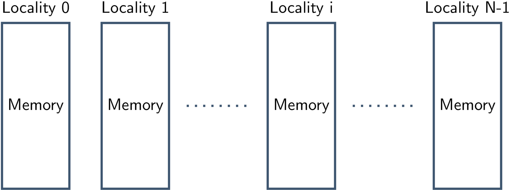

---
## The HPX Programming Model

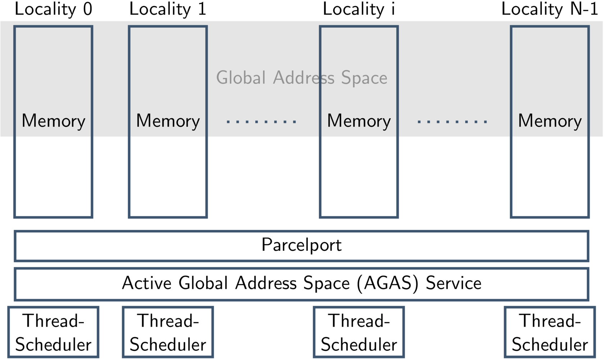

---
## The HPX Programming Model

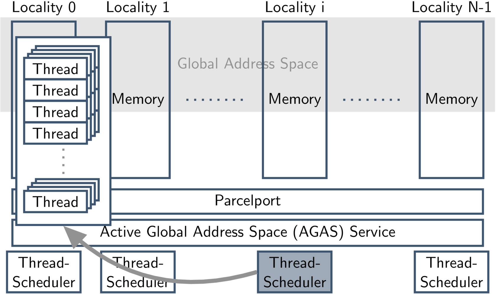

---
## The HPX Programming Model


---
## The HPX Programming Model


---
## HPX - A C++ Standard Library


---
## HPX - A C++ Standard Library

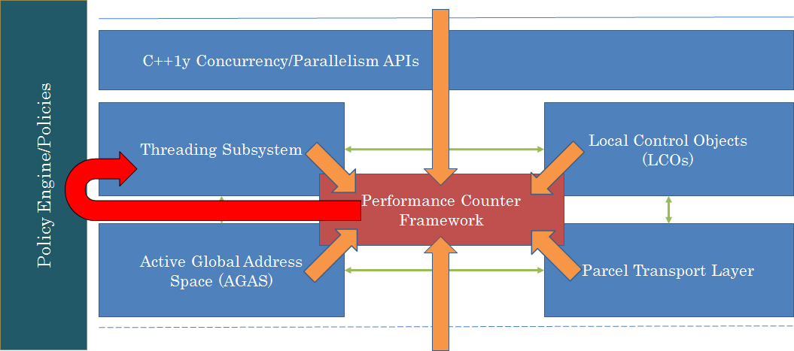

---
## The HPX API
### Strictly conforming to the C++ Standard

Class                           | Description
--------------------------------|-----------------------------------
`hpx::thread`                   | Low level thread of control
`hpx::mutex`                    | Low level synchronization facility
`hpx::lcos::local::condition_variable`      | Signal a condition
`hpx::future`                   | Asynchronous result transport (receiving end)
`hpx::promise`, `hpx::lcos::local::promise` | Asynchronous result transport (producing end)
`hpx::lcos::packaged_task`      | Asynchronous result transport (producing end)
`hpx::async`                    | Spawning tasks (returns a future)
`hpx::bind`                     | Binding Parameters to callables
`hpx::function`                 | Type erased function object
`hpx::tuple`                    | Tuple
`hpx::any`                      | Type erased object (similar to `void*`)
`hpx::parallel::for_each`, etc. | Parallel Algorithms
`hpx::compute::vector`          | Continous storage for N elements, also GPU

Extensions to the standards APIs where necessary, maintaining full compatibility.

---
## The HPX API
### Lightweight Control Objects (LCOs)

 * Objects to synchronize between different threads of execution.
 * Ability to suspend and reactivate tasks
 * Examples:
    * `mutex`
    * `condition_variable`
    * `channel`
    * `promise`
    * `packaged_task`
    * `future`
    * `when_all`, `when_any`, `wait_all`, `wait_any`
    * ...
 * More on those later

---
## The HPX API

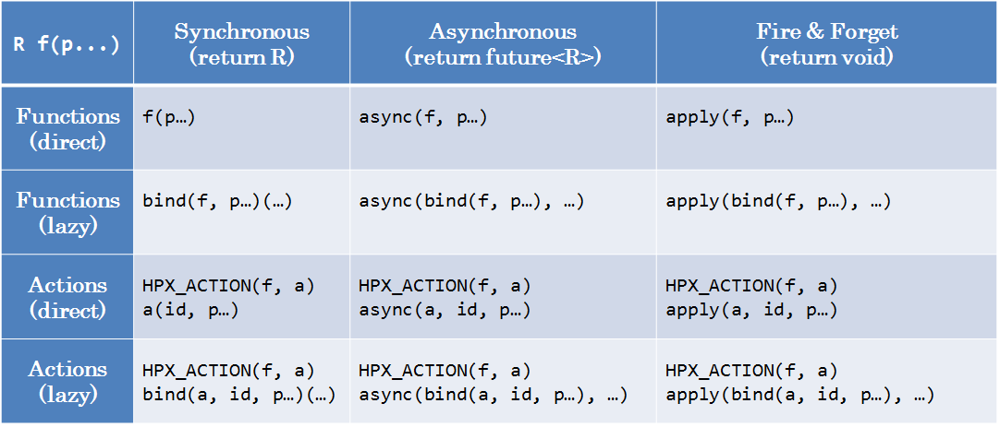

---
## The HPX API


---
## The HPX API

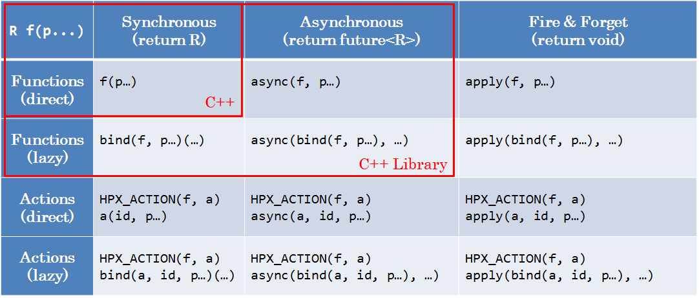

---
## The HPX API


---
## What is a (the) future?

A future is an object representing a result which has not been calculated yet

.left-column[

]

.right-column[
* Enables transparent synchronization with producer
* Hides notion of dealing with threads
* Makes asynchrony manageable
* Allows for composition of several asynchronous operations
* Turns concurrency into parallelism
]

---
## What is a (the) future?

Many ways to get hold of a future, simplest way is to use (std) async:

```
int universal_answer()
{
    return 42;
}
```
--
```
void deep_thought()
{
    future<int> promised_answer = async(&universal_answer);

    // do other things for 7.5 million years

    cout << promised_answer.get() << endl;   // prints 42
}
```

---
## Diving into the Future - The (basic) API

```
template <typename R>
class future
{
    // future constructors
    // Query the state
    // Waiting on the result
};
```
--
```
template <typename R>
class shared_future
{
    // Future constructors
    // Query the state
    // Waiting on the result
};
```

---
## Diving into the Future - The (basic) API

Constructing a `hpx::future<R>`

```
template <typename R>
class future
{
    // Future constructors
    // Construct an empty future.
    future();

    // Move a future to a new one
    future(future<R>&& f);

    // Unwrap a future. The new future becomes ready when
    // the inner, and outer futures are ready.
    explicit future(future<future<R>>&& f);
    explicit future(future<shared_future<R>>&& f);

    // Turn this future into a shared_future. Invalidates the future!
    shared_future<R> share();

    // Query the state
    // Waiting on the result
};
```

---
## Diving into the Future - The (basic) API

Querying the state of the future

```
template <typename R>
class future
{
    // Future constructors

    // Query the state

    // Check if the future is ready yet.
    bool is_ready();

    // Check if the future has a value
    bool has_value();

    // Check if the future has an exception
    bool has_exception();

    // Waiting on the result
};
```

---
## Diving into the Future - The (basic) API

Waiting for the future to become ready
```
template <typename R>
class future
{
    // Future constructors, Query the state...

    // Waiting on the result
    void wait() const;

    // Waiting for the result, but not longer than until given time point
    template <typename Clock, typename Duriation>
    future_status wait_until(
        std::chrono::time_point<Clock, Duration> const& abs_time) const;

    // Waiting for the result, but not longer than give duration
    template <typename Rep, typename Period>
    future_status wait_for(
        std::chrono::duration<Rep, Period> const& rel_time) const;

    // Get the result...
};
```

---
## Diving into the Future - The (basic) API

Waiting for the future to become ready
```
template <typename R>
class future
{
    // Future constructors, Query the state...

    // Waiting on the result...

    // Get the result. This function might block if the result has
    // not been computed yet. Invalidates the future!
    R get();

    // Attach a continuation. The function f gets called with
    // the (ready) future. Returns a new future with the result of
    // the invocation of f. Invalidates the future!
    template <typename F>
    auto then(F&& f);
};
```

---
## Diving into the Future - The (basic) API

Constructing a `hpx::shared_future<R>`

```
template <typename R>
class shared_future
{
    // Future constructors
    // Construct an empty future.
    shared_future();

    // Move a future to a new one
    shared_future(shared_future<R>&& f);

    // Share ownership between two futures
    shared_future(shared_future<R> const& f);

    // Unwrap a future. The new future becomes ready when
    // the inner, and outer future are ready.
    explicit shared_future(shared_future<future<R>>&& f);

    // implicitly share a future
    shared_future(future<R>&& f);

    // Query the state
    // Waiting on the result
};
```

---
## Diving into the Future - The (basic) API

Waiting for the future to become ready
```
template <typename R>
class shared_future
{
    // Future constructors
    // Query the state

    // Waiting on the result
    void wait() const;

    // Get the result. This function might block if the result has
    // not been computed yet.
    R const& get();

    // Attach a continuation. The function f gets called with
    // the (ready) future. Returns a new future with the result of
    // the invocation of f.
    template <typename F>
    auto then(F&& f) const;
};
```

---
## Producing Futures
### `hpx::async`

```
template <typename F, typename... Ts>
auto async(F&& f, Ts&&... ts)
 -> future<decltype(f(std::forward<Ts>(ts)...)>;
```

* `F` is anything callable with the passed arguments (actions are callable)

--

```
template <typename F, typename... Ts>
auto async(launch_policy, F&& f, Ts&&... ts)
 -> future<decltype(f(std::forward<Ts>(ts)...)>;
```

* `launch_policy` can be `async`, `sync`, `fork`, `deferred`

--

```
template <typename Executor typename F, typename... Ts>
auto async(Executor&&, F&& f, Ts&&...  ts)
 -> future<decltpype(f(std::forward<Ts>(ts)...)>;
```

* `Executor` is a concept to be introduced [later](#executors)

---
## Producing Futures
### `hpx::lcos::local::promise`

```
hpx::lcos::local::promise<int> p;       // local only
hpx::future<int> f = p.get_future();
// f.is_ready() == false, f.get(); would lead to a deadlock

p.set_value(42);

// Print 42
std::cout << f.get() << std::endl;
```

---
## Producing Futures
### `hpx::promise`

```
hpx::promise<int> p;                    // globally visible
hpx::future<int> f = p.get_future();
// f.is_ready() == false, f.get(); would lead to a deadlock

hpx::async(
    [](hpx::id_type promise_id)
    {
        hpx::set_lco_value(promise_id, 42);
    }
  , p.get_id());

// Print 42
std::cout << f.get() << std::endl;

```

---
## Producing Futures
### `hpx::make_ready_future`

* Producing futures that are ready at construction

```
template <typename T>
future<typename decay<T>::type> make_ready_future(T&& t);

future<void> make_ready_future();
```

---
## Producing Futures
### And beyond ...

* Futures are the main interface to express asynchrony
* Most API functions in HPX return futures
* This was just an excerpt ... let's see more!


---
## Composing Futures
### Sequential Composition: `future::then`

```
future<int> f1 = hpx::async(...);

// Call continuation once f1 is ready. f2 will become ready once
// the continuation has been run.
future<double> f2 = f1.then(
    [](future<int>&& f) { return f.get() + 0.0; });
```

--

* The continuation needs to take the future as parameter to allow
  for exception handling. Exceptions happening in asynchronous calls
  will get rethrown on `.get()`
* `then` accepts launch policies as well as [executors](#executors)
* `f1` will get invalidated.

--

No invalidation:

```
shared_future<int> f1 = hpx::async(...);

// Call continuation once f1 is ready. f2 will become ready once
// the continuation has been run.
future<double> f2 = f1.then(
    [](future<int>&& f) { return f.get() + 0.0; });
```

---
## Composing Futures
### And Composition: `when_all`

```
future<int> f1 = hpx::async(...);
future<std::string> f2 = hpx::async(...);

auto all_f = hpx::when_all(f1, f2);

future<std::vector<float>> result =
    all_f.then(
        [](auto f) -> std::vector<float>
        {
            // ...
        });
```

--
* Allows for attaching continuations to more than one future
* `f1` and `f2` will get invalidated. (Use `shared_future` if you need them afterwards)
* Also accepts a `std::vector<future<T>>` or a pair of iterators

---
## Composing Futures
### Or Composition: `when_any`

```
std::vector<future<int>> fs = ...;

future<int> fi =
    hpx::when_any(fs).then(
        [](auto f)
        {
            auto res = f.get();
            return res.futures[res.index];
        });
```

* Allows for waiting on *any* of the input futures
* Returns a `future<when_any_result<Sequence>>`:

--

```
template <typename Sequence>
struct when_any_result
{
   std::size_t index; // Index to a future that became ready
   Sequence futures;  // Sequence of futures
};
```


---
## Composing Futures
### Dataflow

* Shortcut to `when_all(...).then(...)`

```
future<int> f1 = hpx::async(...);
future<std::string> f2 = hpx::async(...);

future<double> f3 =
    hpx::dataflow(
        [](future<int>, future<std::string>) -> double
        {
            // ...
        },
        std::move(f1), std::move(f2));

```

--
* Calls the passed function after all arguments that were futures have become ready
* Returns a future that becomes ready once the function has finished execution
* Accepts launch policies as well as [executors](#executors) as the first parameter

---
## Concepts of Parallelism
### Types of Parallelism

* Data parallelism
    * Parallel Algorithms
    * GPUs
* Task based asynchronous and continuation style parallelism
    * `future<R>`, `async`, etc...
* General fork/join style parallelism
* Instruction Level Parallelism
    * SIMD instructions

---
## Concepts of Parallelism
### Parallel Execution Properties

* The ***execution restrictions*** applicable for work items ('safe to be executed concurrently')
* In what ***sequence*** work items have to be executed
* ***Where*** work items should be executed (CPU, NUMA domain, Core, GPU)
* The ***parameters*** of the execution environment (chunk sizes, etc.)

---
## Concepts of Parallelism
### Bringing it all together
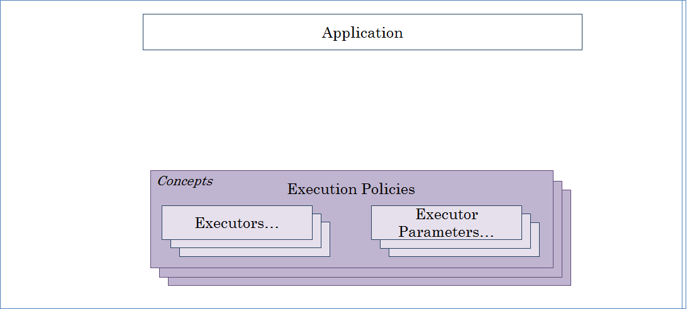

---
## Concepts of Parallelism
### Bringing it all together
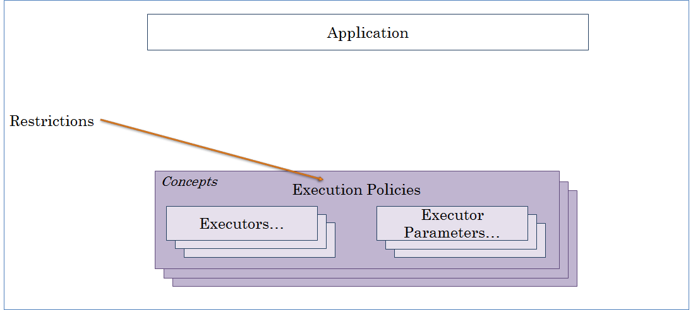

---
## Concepts of Parallelism
### Bringing it all together
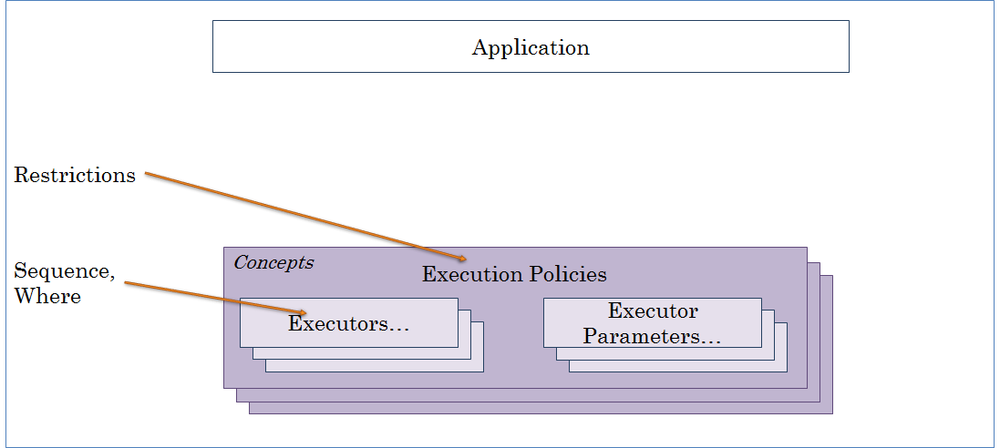

---
## Concepts of Parallelism
### Bringing it all together
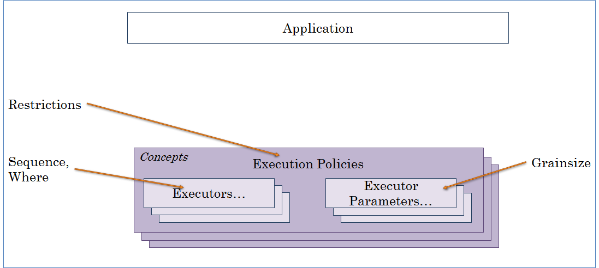

---
## Concepts of Parallelism
### Bringing it all together
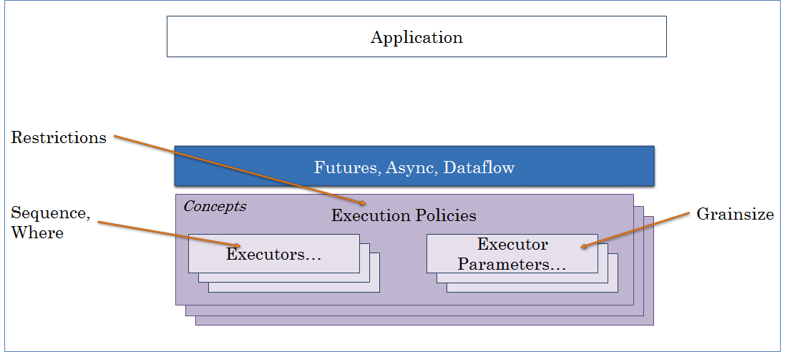

---
## Concepts of Parallelism
### Bringing it all together
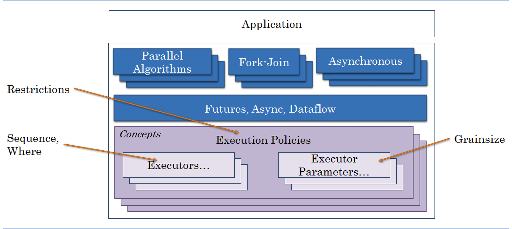

---
## Execution Policies

### From the C++ Standard (C++17)

*  Specify execution guarantees (in terms of thread-safety) for executed parallel tasks:
    * `execution::sequenced_policy: seq`
    * `execution::parallel_policy: par`
    * `execution::unsequenced_policy: unseq`

--
### HPX Extensions

* Asynchronous Execution Policies:
    * `execution::sequenced_task_policy: seq(task)`
    * `execution::parallel_task_policy: par(task)`
* In both cases the formerly synchronous functions return a `future<R>`
* Instruct the parallel construct to be executed asynchronously
* Allows integration with asynchronous control flow

---

name: executors

## Executors
### Concept

* Executors are objects responsible for
    * Creating execution agents on which work is performed (N4466)
    * In N4466 this is limited to parallel algorithms, here much broader use
* Abstraction of the (potentially platform-specific) mechanisms for launching work
* Responsible for defining the **Where** and **How** of the execution of tasks

---
## Executors
### Implementation

* Executors must implement one function:
```
    async_execute(F&& f, Args&&... args)
```
* Invocation of executors happens through `executor_traits` which exposes (emulates) additional functionality:

```
    executor_traits<my_executor_type>::async_execute(
        my_executor,
        [](size_t i){ // perform task i }, n);
```

* Four modes of invocation: single async, single sync, bulk async and bulk sync
* The async calls return a future

---
## Executors
### Examples

* `sequenced_executor`, `parallel_executor`:
    * Default executors corresponding to par, seq
* `this_thread_executor`
* `thread_pool_executor`
    * Specify core(s) to run on (NUMA aware)
* `distribution_policy_executor`
    * Use one of HPX’s (distributed) distribution policies, specify node(s) to run on
* `hpx::compute::host::block_executor`
    * Use a set of CPUs
* `hpx::compute::cuda::default_executor`
    * Use for running things on GPU
* Etc.

---
## Execution Parameters

* Allow to control the grain size of work
    * i.e. amount of iterations of a parallel `for_each` run on the same thread
    * Similar to OpenMP scheduling policies: `static`, `guided`, `dynamic`
    * Much more fine control

---
## Rebind Execution Policies

Execution policies have associated default executor and default executor
parameters

* `par`: parallel executor, static chunk size
* `seq`: sequenced executor, no chunking
    * Rebind executor and executor parameters

```
// rebind only executor
numa_executor exec;
auto policy1 = par.on(exec);
```
--
```
// rebind only executor parameter
static_chunk_size param;
auto policy2 = par.with(param);
```
--
```
// rebind both
auto policy3 = par.on(exec).with(param);
```

---
## Data Placement
### Basics

* Mechanism to tell **where** to allocate data
* C++ defines an Allocator concept `std::allocator<T>`
* Extensions:
    * Where do you want to allocate Data
    * Ability to bulk allocate Data (NUMA aware allocation, GPU Device Allocation)
* Data Structures to use those allocators
* Different strategies for different platforms
    * Need interface to control explicit placement of data
         * NUMA architectures
         * GPUs
         * Distributed systems

---
## Data Placement
### Data Structures

* `hpx::compute::vector<T, Allocator>`
    * Same interface as `std::vector<T>`
    * Manages data locality through allocator
    * Uses execution target objects for data placement
    * Allows for direct manipulation of data on NUMA domains, GPUs, remote nodes, etc.
* `hpx::partitioned_vector<T>`
    * Same interface as `std::vector<T>` (almost)
    * Segmented data store
    * Segments can be `hpx::compute::vector<T>`
    * Uses distribution_policy for data placement
    * Allows for manipulation of data on several targets

---
## Execution Targets

* Opaque type which represent a place in the system
    * Used to identify data placement
    * Used to specify execution site close to data
* Targets encapsulate architecture specifics
    * CPU sets (NUMA domains), Scratch Pad Memory, GPU devices, Remote nodes
* Allocators to be initialized from targets
    * Customization of data placement
* Executors to be initialized from targets as well
    * Make sure code is executed close to placed data

---
## Parallel Algorithms

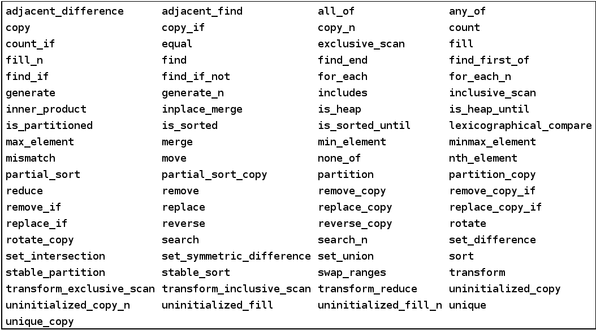

---
## Example: SAXPY - The HPX Way

**Goal**: SAXPY routine with data locality

* `a[i] = b[i] * x + c[i]` for `i` from `0` to `N-1`
* Using parallel algorithms
* Explicit control over data locality
* No raw loops

---
## Example: SAXPY - The HPX Way

**Step 1**: Writing the serial version

.left-column[
```
std::vector<double> a = ...;
std::vector<double> b = ...;
std::vector<double> c = ...;
double x = ...;

std::transform(
    b.begin(), b.end(), c.begin(),
    a.begin(),
    [x](double bb, double cc)
    {
*       return bb * x + cc;
    }
);
```
]

.right-column[
* `bb` is `b[i]`
* `cc` is `c[i]`
* the calculated value gets written to `a[i]`
* [Complete code](https://github.com/STEllAR-GROUP/tutorials/tree/master/examples/04_saxpy/serial.cpp)
]

---
## Example: SAXPY - The HPX Way

**Step 2**: Parallelize it

.left-column[
```
std::vector<double> a = ...;
std::vector<double> b = ...;
std::vector<double> c = ...;
double x = ...;

*hpx::parallel::transform(
*   hpx::parallel::execution::par,
    b.begin(), b.end(), c.begin(),
    a.begin(),
    [x](double bb, double cc)
    {
        return bb * x + cc;
    }
);
```
]

.right-column[
* Replace the standard algorithm with a parallel one
* Set parallel exeuction policy
* [Complete code](https://github.com/STEllAR-GROUP/tutorials/tree/master/examples/04_saxpy/parallel.cpp)
]

---
## Example: SAXPY - The HPX Way

**Step 3**: Adding data locality

.left-column[
```
using hpx::compute::host;

typedef block_executor<> executor;
typedef block_allocator<double>
    allocator;

auto numa_domains = numa_nodes();
executor exec(numa_domains);
allocator alloc(numa_domains);

using hpx::compute::vector;

vector<double, allocator> a = ...;
vector<double, allocator> b = ...;
vector<double, allocator> c = ...;
double x = ...;
```
]

.right-column[
```
*using hpx::parallel::execution::par;
*auto policy = par.on(exec);
hpx::parallel::transform(policy,
    b.begin(), b.end(), c.begin(),
    a.begin(),
    [x](double bb, double cc)
    {
        return bb * x + cc;
    }
);
```
* Get targets for locality of data and execution
* Setup Executor and Allocator
* Run on the allocator
* [Complete code](https://github.com/STEllAR-GROUP/tutorials/tree/master/examples/04_saxpy/parallel_numa.cpp)
]

---
## Example: SAXPY - The HPX Way

**Optional Step**: Running it on the GPU

.left-column[
```
using hpx::compute::cuda;

typedef default_executor<> executor;
typedef allocator<double> allocator;

target device("K40");
executor exec(device);
allocator alloc(device);

using hpx::compute::vector;

vector<double, allocator> a = ...;
vector<double, allocator> b = ...;
vector<double, allocator> c = ...;
double x = ...;
```
]
.right-column[
```
*using hpx::parallel::execution::par;
*auto policy = par.on(exec);
hpx::parallel::transform(policy,
    b.begin(), b.end(), c.begin(),
    a.begin(),
    [x](double bb, double cc)
    {
        return bb * x + cc;
    }
);
```
* Get targets for locality of data and execution
* Setup Executor and Allocator
* Run on the allocator
* [Complete code](https://github.com/STEllAR-GROUP/tutorials/tree/master/examples/04_saxpy/parallel_cuda.cu)
* Works only for CUDA version 8 :(
]

---
class: center, middle
## Next

[Building HPX and Applications](../session3)

