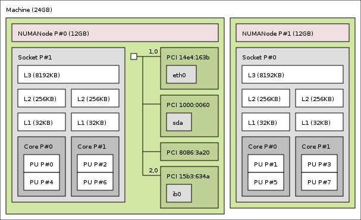

class: center, middle

# Building and Running HPX
## CMake, Options, Dependencies

[Overview](..)

Previous: [Introduction to HPX - Part 2 (API)](../session2)

???
[Click here to view the Presentation](https://stellar-group.github.io/tutorials/hlrs2019/session3/)

---
## Dependencies

* Boost
* Hwloc
* A good allocator

---
## Dependencies #1
### Boost
HPX uses Boost extensively throughout the code
* Considerable amounts of boost code have been absorbed into HPX
    * so dependencies on boost are been gradually decreasing
    * (more `std::` features are present in newer compilers)

* Threading components, locks and mutexes
* Boost.context used for basis of lightweight threads
    * switching from one task to another
    * stack management etc
* Boost.program-options used for command line handling
* Boost.lockfree stacks and queues
* Boost.asio in startup code (TCP etc)
* Boost.preprocessor for lots of scary macros
* many boost utilities/algorithms all over the place

---
## Dependencies #1
### Installing Boost
* Boost is not nearly as hard to install as people think

```sh
# download
wget http://vorboss.dl.sourceforge.net/project/boost/boost/1.63.0/boost_1_63_0.tar.gz

# untar
tar -xzf boost_1_63_0.tar.gz

# build
cd boost_1_63_0
./bootstrap.sh
./b2 cxxflags="-std=c++14" \
  --prefix=/path/to/boost/1.63.0 \
  --layout=versioned threading=multi link=shared \
  variant=release,debug \
  address-model=64 -j8 install

```
* It takes 10 minutes or less to build (most is headers)
* Best to build debug and release if you are tinkering with HPX settings
* Or just use the preinstalled boost modules

---
## Dependencies #2
### Portable Hardware Locality (hwloc)

* HPX needs to know what resources it is running on
* hwloc provides a mechanism for identifying numa domains, sockets, cores, GPUs
* HPX uses hwloc for thread pinning
    * at startup - and also in code
* executors can be bound to cores/domains using hwloc syntax
* `local_priority_queue_os_executor exec(4, "thread:0-3=core:12-15.pu:0");`
* startup binding : `--hpx:bind=compact/scatter/balanced`

---
## Dependencies #2
### Installing hwloc

```sh
# download a tarball (version 1.11.5 latest @ March 2017)
wget --no-check-certificate \
https://www.open-mpi.org/software/hwloc/v1.11/downloads/hwloc-1.11.5.tar.gz

# untar
tar -xzf hwloc-1.11.5.tar.gz

# configure and install
cd hwloc-1.11.5
./configure --prefix=/path/to/hwloc/1.11.5
make -j8 install
```

* It takes a couple of minutes and you just need to pass the path into your HPX CMake

---
## Dependencies #3
### jemalloc
"jemalloc is a general purpose malloc(3) implementation that emphasizes
    fragmentation avoidance and scalable concurrency support"
* TCMalloc may be used with very similar performance to jemalloc
    * (disclaimer: other memory managers exist)

* HPX is C++ - new/delete are used everywhere.
    * `vector<>/queue<>` and friends are used for storage inside the
    runtime, schedulers, parcelports
    * user tasks are likely to contain allocation of memory for objects

* built in malloc is inefficient when used in multithreaded environments
* HPX compiled with jemalloc can be >10% faster then without
    * (subject to workload/algorithms implemented/used)

---
## Dependencies #3
### Installing jemalloc

* jemalloc can be downloaded via github and there isn't a direct link

```sh
# Download
# visit https://github.com/jemalloc/jemalloc/releases
JEMALLOC_VER=4.5.0
wget https://github.com/jemalloc/jemalloc/releases/download/$JEMALLOC_VER/jemalloc-$JEMALLOC_VER.tar.bz2

# untar
tar -xjf jemalloc-$JEMALLOC_VER.tar.bz2

# configure and install
cd jemalloc-$JEMALLOC_VER
./autogen.sh
./configure --prefix=$INSTALL_ROOT/jemalloc/$JEMALLOC_VER
make -j8 -k install
```

* It takes a couple of minutes and you just need to pass the path into your HPX CMake

---
## OTF2
```sh
wget http://www.vi-hps.org/upload/packages/otf2/otf2-2.0.tar.gz
tar -xzf otf2-2.0.tar.gz
cd otf2-2.0/
./configure --prefix=/path/to/otf2/2.0/ --enable-shared
make -j8 install
```
---
## Compiling on supercomputers

* Hazelhen has login nodes that are binary compatible with compute nodes

    * No need to setup a cross-compiling toolchain

* HPX contains toolchain files for several machines

    * Look in `hpx/cmake/toolchains`

* You can use them to reduce slightly the number of options set by hand

    * (HPX cmake is quite good and works on all the machines I've tried)

---
## HPX CMake: Release (for Crays)
```cmake
cmake \
 -DCMAKE_BUILD_TYPE=Release \
 -DCMAKE_TOOLCHAIN_FILE=/path/to/source/hpx/cmake/toolchains/Cray.cmake \
 -DCMAKE_INSTALL_PREFIX=/path/to/hpx/master/release \
 -DHWLOC_ROOT=/path/to/hwloc/1.11.5 \
 -DHPX_WITH_HWLOC=ON \
 -DHPX_WITH_MALLOC=JEMALLOC \
 -DBOOST_ROOT=/path/to/boost/1.63.0 \
 -DJEMALLOC_ROOT=/path/to/jemalloc/4.4.0 \
 -DHPX_WITH_TESTS=OFF \
 -DHPX_WITH_EXAMPLES=OFF \
 -DHPX_WITH_THREAD_IDLE_RATES=ON \
 /path/to/source/hpx
```

---
## HPX CMake : Debug
```cmake
cmake \
 -DCMAKE_BUILD_TYPE=Debug \
 -DCMAKE_TOOLCHAIN_FILE=/path/to/source/hpx/cmake/toolchains/Cray.cmake \
 -DCMAKE_INSTALL_PREFIX=/path/to/hpx/master/debug \
 -DHWLOC_ROOT=/path/to/hwloc/1.11.5 \
 -DHPX_WITH_HWLOC=ON \
 -DHPX_WITH_MALLOC=JEMALLOC \
 -DBOOST_ROOT=/path/to/boost/1.63.0 \
 -DJEMALLOC_ROOT=/path/to/jemalloc/4.4.0 \
 -DHPX_WITH_TESTS=OFF \
 -DHPX_WITH_EXAMPLES=OFF \
 -DHPX_WITH_THREAD_IDLE_RATES=ON \
 /apps/daint/hpx/src/hpx
```

---
## HPX CMake: RelWithDebInfo (profiling)
###APEX + TAU + PAPI + OTF2
```cmake
cmake \
 -DCMAKE_BUILD_TYPE=RelWithDebInfo \
 -DCMAKE_TOOLCHAIN_FILE=/path/to/source/hpx/cmake/toolchains/Cray.cmake \
 -DCMAKE_INSTALL_PREFIX=/path/to/hpx/master/profiling \
 -DHWLOC_ROOT=/path/to/hwloc/1.11.5 \
 -DHPX_WITH_HWLOC=ON \
 -DHPX_WITH_MALLOC=JEMALLOC \
 -DBOOST_ROOT=/path/to/boost/1.63.0 \
 -DJEMALLOC_ROOT=/path/to/jemalloc/4.4.0 \
 -DHPX_WITH_TESTS=OFF \
 -DHPX_WITH_EXAMPLES=OFF \
 -DHPX_WITH_PAPI=ON \
 -DHPX_WITH_APEX=ON -DAPEX_WITH_PAPI=ON \
 -DAPEX_WITH_OTF2=ON -DAPEX_WITH_TAU=ON \
 -DOTF2_ROOT=/path/to/otf2/2.0 \
 -DTAU_ROOT=/path/to/tau/2.25 \
 -DHPX_WITH_THREAD_IDLE_RATES=ON \
 /apps/daint/hpx/src/hpx
```

---
## Release vs Debug
* How much faster will a release build be compared to a debug one?

    * Lots faster

    * When building release mode, the compiler will inline all the function invocation
    code that is used by the template instantiations to specialize on different types etc.

    * Stack traces in debug mode can be 50-70 funcion calls deep

    * in release mode they might be only 5-7

    * nearly all of HPX is headers with extensive specializations of functions/algorithms
    and huge amounts of this are optimized away by the compiler in release mode

    * never profile anything in debug mode except for checking if you made it faster or
    slower than the previous test
---
## Building tips #1

* Building _all_ of HPX can take a long time

* On your first build, enable `HPX_WITH_EXAMPLES` and `HPX_WITH_TESTS`
    * `make -j8 hello_world_1_exe`
    * check it compiles
    * check it runs

* if hello world is ok, then build the rest (at your discretion)
    ```sh
    make tests.unit tests.regression examples
    ```
* use `make help` to dump out a list of targets

* run tests
```sh
ctest -R tests.unit
```

* note that some tests run distributed so you need to first allocate some nodes
to ensure that mpi works
```sh
salloc -N 2
```

---
## Building tips #2
* Note : `make -j8 xxx` can cause problems
    * HPX uses a _lot_ of templates and the compiler can use all your memory
    * if disk swapping starts during compiling use `make -j2` (or `j4` etc)

* in your own CMakeLists.txt you can
```cmake
    add_executable(my_test ${MY_SRSC})
    hpx_setup_target(my_test)
```

---
## Build tutorial examples (on Hazelhen)
```sh
# get tutorial material, https://github.com/STEllAR-GROUP/tutorials
cp -r ~/tutorials ~/personal/space/tutorials

# create a build dir
mkdir build
cd build

# make sure you load all the modules we'll use in tutorial. This is already done
# for the tutorial account
module switch PrgEnv-cray/5.2.82 PrgEnv-gnu
module load tools/cmake/3.4.2
module load tools/git
# setup hwloc
export PATH=$HOME/hpx/hwloc-1.11.5/bin:$PATH
export LD_LIBRARY_PATH=$HOME/hpx/hwloc-1.11.5/lib:$LD_LIBRARY_PATH
export PKG_CONFIG_PATH=$HOME/hpx/hwloc-1.11.5/lib/pkgconfig:$PKG_CONFIG_PATH
# setup jemalloc
export LD_LIBRARY_PATH=$HOME/hpx/jemalloc-4.4.0/lib:$LD_LIBRARY_PATH
export PKG_CONFIG_PATH=$HOME/hpx/jemalloc-4.4.0/lib/pkgconfig:$PKG_CONFIG_PATH

export BOOST_ROOT=/opt/hlrs/tools/boost/1.62.0


# for debug: ~/hpx/build/debug/environment.sh
# for profiling with APEX: ~/hpx/build/profiling-apex/environment.sh
# for profiling with VTUNE: ~/hpx/build/profiling-itt/environment.sh
source ~/hpx/build/release/environment.sh

#  CMake with examples path (debug: -DCMAKE_BUILD_TYPE=Debug/RelWithDebInfo)
cmake -DCMAKE_BUILD_TYPE=Release ../tutorials/examples

# make the demos
make -j4
```

---
## Build tutorial on laptop etc

* Clone tutorial repo as before

* Create build dir

* invoke CMake with PATH to HPX (build tree or install tree)

```sh
cmake -DHPX_DIR=${path_to_hpx_install} ${path_to_tutorials}/examples
cmake -DHPX_DIR=${path_to_hpx_build}   ${path_to_tutorials}/examples
```
* note that for a build tree you might want

```sh
cmake -DHPX_DIR=${path_to_hpx_build}/lib/cmake/HPX
  ${path_to_tutorials}/examples
```

* ...and set a build going

```sh
make -j4
```

---
## CMakeLists.txt for a set of test projects

Follow this link to see the
[CMakeLists for (top level) tutorial superproject](../../examples/CMakeLists.txt)

Main requirement of CMakeLists is

`find_package(HPX REQUIRED)`

and for targets

`hpx_setup_target(target [COMPONENT_DEPENDENCIES iostreams])`

* Note that `NO_CMAKE_PACKAGE_REGISTRY` is there to stop CMake from looking in
user build/install dirs in preference to module paths etc.
    * if you build a lot of versions, CMake tries to help by creating a registry
    that can cause the wrong one to be chosen (despite any overiding options you use)

* Top level CMakeLists calls `find_package` once to save each example dir finding again
    * recall that scope of vars by default in CMake is directory based
    * and subdirs inherit from parents

---
## CMakeLists.txt for a simple test project
Follow this link [CMakeLists for Stencil](../../examples/02_stencil/CMakeLists.txt)
to see the CMakeLists file for one of the examples

This example contains multiple binaries, all are added using the same simple syntax

```cmake
add_executable(stencil_serial stencil_serial.cpp)
hpx_setup_target(stencil_serial)
```

`hpx_setup_target` should get all the link dirs/lib and dependencies that you need

Occasionally you might need to add additional components such as the hpx iostreams
library, but in this example, `hpx::cout` is not being used and it is therefore not
needed. See [CMakeLists for Hello World](../../examples/00_hello_world/CMakeLists.txt) for
an example of how it is used

If you require other links to be added, you can continue to use
```cmake
target_link_libraries(solver_reference
    solver_mini_lib
    ${ALGEBRA_LIBS}
)
```

---
## Building tips #3

* HPX is a changing target as many commits are being made daily

* You may find bugs [cue laughter] and submit issues to the github tracker

* When they are fixed (often quickly) you will want to pull the changes

* You need to maintain a good synchronization between your HPX build and your
test project build

* You can setup a top level CMakeLists.txt containing subdirs, one for
your test project, and allow CMake to create a subdir for HPX too

* You can build HPX and your test code in a single CMake based setup
    * Like a git submodule, but managed by CMake rather than git
    * you can work on an HPX branch ...
    * ... merge fixes in, make local changes freely
    * push and pull from the origin

* Or, you can use a released version of HPX
    * We aim to release a new version every 6 months

---
## Building tips #3 : An HPX superproject
* Add an option to download and build HPX as a subproject in a top level CMakeLists.txt
as follows

```cmake
option(HPX_DOWNLOAD_AS_SUBPROJECT OFF) # default is no
if (HPX_DOWNLOAD_AS_SUBPROJECT)
  list(APPEND CMAKE_MODULE_PATH ${PROJECT_SOURCE_DIR}/cmake)
  include(hpx_download)
  add_subproject(HPX hpx)
endif()
```

* The contents of the [hpx_download](../../examples/cmake/hpx_download.cmake)
make use of two additional script/macro files
[GitExternal](../../examples/cmake/GitExternal.cmake),
[SubProject](../../examples/cmake/SubProject.cmake)

    * Note that SHALLOW and VERBOSE are options that may be removed

---
## Building tips #3 : An HPX superproject #2

* A superproject allow us to add HPX as a subdirectory in our top level source tree,
build HPX and set HPX\_DIR to the binary location so that later when our example projects
do `find_package(HPX)` everything points to our _in tree_ copy of HPX.

    * No need to worry about Release/Debug incompatibility
    * No need to worry about wrong versions of boost/hwloc/jemalloc
    * No need to worry about wrong compiler flags
    * `make -j8 my_example` will build libhpx etc automatically
    * any changes to HPX after pull/merge automatically trigger a rebuild

* When building, you must now pass

    * `-DHPX_DOWNLOAD_AS_SUBPROJECT=ON`
    * all `HPX_XXX` CMake options/variables that you need (as before)
    * all your own options/variables to the CMake invocation

* You can enable/disable the HPX subproject and switch back to a system/custom HPX
at any time (though I recommend using branches in the HPX subdir).

* The SubProject Macros will not overwrite your loal changes after the initial checkout

---
## Superproject build on OSX with Xcode 8
```sh
cmake \
 -DCMAKE_BUILD_TYPE=Release \
 -DCMAKE_CXX_FLAGS=-std=c++14 \
 -DCMAKE_INSTALL_PREFIX=/Users/biddisco/apps/tutorial \
 -DHPX_WITH_NATIVE_TLS=ON \
 -DHPX_WITH_PARCELPORT_MPI=ON \
 -DHPX_WITH_PARCELPORT_TCP=ON \
 -DHPX_WITH_THREAD_IDLE_RATES=ON \
 -DHPX_WITH_TESTS=ON \
 -DHPX_WITH_TESTS_EXTERNAL_BUILD=OFF \
 -DHPX_WITH_EXAMPLES=ON \
 -DBOOST_ROOT=/Users/biddisco/apps/boost/1.59.0 \
 -DBoost_COMPILER=-xgcc42 \
 -DHWLOC_ROOT:PATH=/Users/biddisco/apps/hwloc/1.11.4 \
 -DHWLOC_INCLUDE_DIR:PATH=/Users/biddisco/apps/hwloc/1.11.4/include \
 -DHWLOC_LIBRARY:FILEPATH=/Users/biddisco/apps/hwloc/1.11.4/lib/libhwloc.dylib \
 -DHPX_WITH_MALLOC=JEMALLOC \
 -DJEMALLOC_INCLUDE_DIR:PATH=/Users/biddisco/apps/jemalloc/4.2.1/include \
 -DJEMALLOC_LIBRARY:FILEPATH=/Users/biddisco/apps/jemalloc/4.2.1/lib/libjemalloc.dylib \
 -DHPX_DOWNLOAD_AS_SUBPROJECT=ON \
 -DSUBPROJECT_HPX=ON \
 ~/src/tutorials/examples

 make -j8 tutorial
```
Warning TLS not available on earlier XCode versions - use Boost 1.59.0 only on XCode 7.x

---
## Main HPX Build options #1

* General format is HPX_WITH_FEATURE_X
    * if Feature_X is available and working, then in the code you get
    `#define HPX_HAVE_FEATURE_X`
    * in build dir, config `#defines` written `<hpx/config/defines.hpp>`

* All options are documented on
[this page of HPX build options](https://stellar-group.github.io/hpx/docs/sphinx/latest/html/manual/building_hpx.html#cmake-variables-used-to-configure-hpx)

---
## Main HPX Build options #2
* Generic options
    * HPX_WITH_CUDA: Enables latest features to interface with GPUs using CUDA.
    * HPX_WITH_GENERIC_CONTEXT_COROUTINES: when ON, uses Boost.context for
    lightweitht threads, otherwise some platform provided lib (windows=fibers)
    * HPX_WITH_LOGGING: when enabled can produce huge amounts of debug info
    * HPX_WITH_NATIVE_TLS: Thread local storage, turn on unless on Xcode<8
    * HPX_WITH_PARCEL_COALESCING: gathers messages together when they can't be sent immediately
    * HPX_WITH_RUN_MAIN_EVERYWHERE: when on, main is called on all localities, when off,
    only root has int main called - to be discussed further
    * HPX_WITH_VC_DATAPAR: latest SIMD code option using Vc library

---
## Main HPX Build options #3
* Thread options
    * HPX_WITH_STACKTRACES: Shows you where your exception was thrown in debug mode
    * HPX_WITH_THREAD_BACKTRACE_ON_SUSPENSION: When tasks are suspended, capture a
    backtrace for debugging. (wasn't working last time I tried it - but need it).
    * HPX_WITH_THREAD_CREATION_AND_CLEANUP_RATES: HPX_WITH_THREAD_CUMULATIVE_COUNTS:
    HPX_WITH_THREAD_QUEUE_WAITTIME: HPX_WITH_THREAD_STEALING_COUNTS:
    * HPX_WITH_THREAD_IDLE_RATES: performance counters for threading subsytem -
    Enable measuring the percentage of overhead times spent in the scheduler
    * HPX_WITH_THREAD_LOCAL_STORAGE:On everywhere except OSX pre Xcode 8
    * HPX_WITH_THREAD_MANAGER_IDLE_BACKOFF: Performance tweaking -
    HPX scheduler threads are backing off on idle queues
    * HPX_WITH_THREAD_SCHEDULERS: enable different thread schedulers -
    Options are: all, abp-priority, local, static-priority, static, hierarchy,
    and periodic-priority.
    * HPX_WITH_THREAD_TARGET_ADDRESS: Enable storing target address in thread for
    NUMA awareness (never tried this)

---
## Main HPX Build options #4
* Parcelport options
    * HPX_WITH_PARCELPORT_MPI: Yes
    * HPX_WITH_PARCELPORT_MPI_ENV: allows you to control the Env vars used to detect
    nodes etc
    * HPX_WITH_PARCELPORT_MPI_MULTITHREADED: Yes
    * HPX_WITH_PARCELPORT_TCP: depends, but usually Yes
    * HPX_WITH_PARCEL_PROFILING: (still under development), but will give details about
    parcel traces/dependencies to help with profiling

---
## Apex trace output

* To generate trace files compatible with Vampir etc.
```sh
export APEX_TAU=1
export APEX_OTF2=1
export APEX_PROFILE=1
export APEX_SCREEN_OUTPUT=1
export TAU_TRACE=1
```
*   OTF2 trace files generated in OTF2

---
# Hello World!
## Options and Running Applications

* HPX comes with a large set of options you can pass through the command line
* We will cover a few
* [Read the docs!](http://stellar-group.github.io/hpx/docs/sphinx/latest/html/index.html)

---
## Running An HPX application using ALPS

* No difference to a regular MPI application
* qsub -I -X -lnodes=1:ppn=24,walltime=1:00:00 -q R_course
* aprun -n 1 -N 1 -d 24 ./my_prog
    * -n determines the number of nodes
    * -N The number of localities per node
    * -d The number of cores to use

---
## Overview
### Command line parameters

```INI
$ ./bin/hello_world_1 --hpx:help

Usage: unknown HPX application [options]:

HPX options (allowed on command line only):
  --hpx:help [=arg(=minimal)]           print out program usage (default: this
                                        message), possible values: 'full'
                                        (additionally prints options from
                                        components)
  --hpx:version                         print out HPX version and copyright
                                        information
  --hpx:info                            print out HPX configuration information
  --hpx:options-file arg                specify a file containing command line
                                        options (alternatively: @filepath)

HPX options (additionally allowed in an options file):
  --hpx:run-agas-server                 run AGAS server as part of this runtime
                                        instance
  --hpx:run-hpx-main                    run the hpx_main function, regardless
                                        of locality mode

... And much more ...
```

---
## Overview
### The HPX INI Config

```INI
$ ./bin/hello_world --hpx:dump-config
Configuration after runtime start:
----------------------------------
============================
  [application]
  [hpx]
    'affinity' : 'pu'
    'bind' : 'balanced'
    'cmd_line' : './bin/hello_world --hpx:dump-config'
    'component_path' : '$[hpx.location]:$[system.executable_prefix]' -> '/apps/daint/hpx/0.9.99/gnu_530/debug:/users/heller/tutorials/examples/build/debug'
    'component_path_suffixes' : '/lib/hpx:/bin/hpx'
    'cores' : '1'
    'expect_connecting_localities' : '1'
    'finalize_wait_time' : '-1.0'
    'first_pu' : '0'

... And much more ...
```
* Can be set with `-I...`
	* Example: `-Ihpx.bind=compact`

---
## Dumping Version Information
### `--hpx:version`

```
$ ./bin/hello_world --hpx:version

HPX - High Performance ParalleX
A general purpose parallel C++ runtime system for distributed applications
of any scale.

Copyright (c) 2007-2016, The STE||AR Group,
http://stellar-group.org, email:hpx-users@stellar.cct.lsu.edu

Distributed under the Boost Software License, Version 1.0. (See accompanying
file LICENSE_1_0.txt or copy at http://www.boost.org/LICENSE_1_0.txt)

Versions:
  HPX: V1.0.0-trunk (AGAS: V3.0), Git: 4f281039e4
  Boost: V1.61.0
  Hwloc: V1.11.0
  MPI: MPICH V3.2rc1, MPI V3.1

Build:
  Type: debug
  Date: Sep 28 2016 11:42:06
  Platform: linux
  Compiler: GNU C++ version 5.3.0 20151204 (Cray Inc.)
  Standard Library: GNU libstdc++ version 20151204
  Allocator: JEMALLOC
```

---
## Controlling CPU binding
### General

* Use `--hpx:print-bind` to show the selected bindings
* Use `--hpx:threads=N` to select the number of threads per locality
* Use `--hpx:cores=N` to select the number of cores

---
## Controlling CPU binding
### Binding the HPX worker threads to specific CPU Cores

.left-column[
* `--hpx:bind=...`
    * `compact`
    * `scatter`
	* `balanced`
	* _description_
]
.right-column[

]

---
## Controlling CPU binding
### Binding the HPX worker threads to specific CPU Cores

* Bind Description:

.left-column[
```
mappings:
    distribution
    mapping(;mapping)*

distribution:
    'compact'
    'scatter
    'balanced'

mapping:
    thread-spec=pu-specs

thread-spec:
    'thread':range-specs

pu-specs:
    pu-spec(.pu-spec)*
```
]
.right-column[

```

pu-spec:
    type:range-specs
    ~pu-spec

range-specs:
    range-spec(,range-spec)*

range-spec:
    int
    int-int
    'all'

type:
    'socket' | 'numanode'
    'core'
    'pu'
```
]

---
## Controlling CPU binding
### Binding the HPX worker threads to specific CPU Cores

* Use `lstopo` to get an idea of your CPU topology
* Bind Description, Examples:

```
# 4 worker threads, running on the first 4 CPUs using the first Hyperthread
$ ./bin/hello_world --hpx:threads=4 --hpx:print-bind \
	--hpx:bind="thread:0-3=core:0-3.pu:0"
****************************************************************
locality: 0
   0: PU L#0(P#0), Core L#0(P#0), Socket L#0(P#0), Node L#0(P#0)
   1: PU L#1(P#2), Core L#1(P#1), Socket L#0(P#0), Node L#0(P#0)
   2: PU L#2(P#4), Core L#2(P#2), Socket L#0(P#0), Node L#0(P#0)
   3: PU L#3(P#6), Core L#3(P#3), Socket L#0(P#0), Node L#0(P#0):
```

```
# 4 worker threads, running on the first 2 run on NUMA domain 0, using the second
# and third core, worker thread 3 runs on the second NUMA on the 7th core, worker
# thread 4 on the 2nd NUMA and 8th worker core, using the first Hyperthread
$ ./bin/hello_world --hpx:threads=4 --hpx:print-bind \
	--hpx:bind="thread:0-1=socket:0.core:0-2.pu:0;thread:2-3=socket:1.core:6-7.pu:0"
****************************************************************
locality: 0
   0: PU L#0(P#0), Core L#0(P#0), Socket L#0(P#0), Node L#0(P#0)
   1: PU L#1(P#2), Core L#1(P#1), Socket L#0(P#0), Node L#0(P#0)
   2: PU L#13(P#11), Core L#13(P#5), Socket L#1(P#1), Node L#1(P#1)
   3: PU L#14(P#13), Core L#14(P#6), Socket L#1(P#1), Node L#1(P#1)
```

* Note: This was run on the head node of daint. Try it on the compute nodes!

---
## Distributed Runs
### General

* HPX itself doesn't come with a dedicated launcher (like `mpirun`)
	* `--hpx:localities=N`: using N localities
	* `--hpx:locality=i`: ith locality
	* `--hpx:agas=host`: The root (locality 0) process host
	* `--hpx:hpx=host`: The host this HPX process is listening on
* Manual setup tedious:
	* Start N processes, set correct parameters...

---
## Distributed Runs
### `hpxrun.py`

* Small wrapper script to allow easy setup for distributed runs:

```
  -h, --help            show this help message and exit
  -l LOCALITIES, --localities=LOCALITIES
                        Number of localities to run (environment variable
                        HPXRUN_LOCALITIES
  -t THREADS, --threads=THREADS
                        Number of threads per locality (environment variable
                        HPXRUN_THREADS)
  -p PARCELPORT, --parcelport=PARCELPORT
                        Which parcelport to use (Options are: ibverbs, ipc,
                        mpi, tcp) (environment variable HPXRUN_PARCELPORT
  -r RUNWRAPPER, --runwrapper=RUNWRAPPER
                        Which runwrapper to use (Options are: none, mpi, srun)
                        (environment variable HPXRUN_ (environment variable
                        HPXRUN_RUNWRAPPER)
  -e EXPECTED, --expected=EXPECTED
                        Expected return codes of all invoked processes
                        (environment variable HPXRUN_EXPECTED)
  -v, --verbose         Verbose output (environment variable HPXRUN_VERBOSE)

```

---
## Batch environments
### General

* The HPX startup routines can detect Batch systems
* Extracts the needed information to setup the Application:
	* Number of threads
	* Number of localities
	* Host names
* Supported environments: SLURM, PBS, ALPS, MPI

---
## Batch environments
### SLURM

* HPX startup parses the various Environment Variables set by SLURM:
	* Number of Nodes to use
	* Number of Threads to use
	* List of nodes of the allocation
* Use `salloc` to get an allocation, `srun` to start the application
* Useful parameters
	* `-n`: Number of Processes
	* `-N`: Number of Nodes to distribute Processes on
	* `-c`: Number of cores
	* `--hint=nomultithread`: Turn of multithreading

---
## Batch environments
### MPI

Note: The following only applies if you have the MPI parcelport compiled in

* Just use mpirun to start your distributed Application, we will use the number
 of ranks, and the rank to communicate with MPI routines.
* Read the documentation of your Supercomputer on how to launch MPI
 jobs.
* You usually want one process (==locality) per node!
* Note to Cray users:
	* If you have SLURM on your cray, srun will automatically activate MPI
	* If using plain ALPS, aprun has the same effect

---
## Distributed Runs
### Selecting parcelports

* `--hpx:list-parcel-ports`: Lists which parcelports are available and enabled
* Use the INI configuration to explicitly disable/enable Parcelports:
	* `-Ihpx.parcel.tcp.enable=0` will disable the TCP parcelport

---
## Debugging options

* Attach a debugger:
	* `--hpx:attach-debugger`: This will stop the HPX application and wait for
		the debugger to be attached and the application being continued
	* `--hpx:attach-debugger=exception`: Stops the application if there was an
		exception
* Logging:
	* `--hpx:debug-hpx-log`
* Debug command line parsing:
	* `--hpx:debug-clp`

---
## Performance Counters

* List all available performance counters:
	* `--hpx:list-counters`
* Print counter:
	* `--hpx:print-counter counter`
	* This will print the counter once the application has been completed
* Set counter interval:
	* `--hpx:print-counter-interval time`
* Print performance counters from your application:
	* `hpx::evaluate_active_counters(bool reset, char const* description)`

---
## HPX Application Startup
### `hpx::init`

```
#include <hpx/hpx_init.hpp>

int hpx_main()
{
	// Initiate HPX shutdown
	return hpx::finalize()
}

int main(int argc, char** argv)
{
	hpx::init(argc, argv);
}
```

---
## Adding your own options
### Use C-style main

```
#include <hpx/hpx_init.hpp>

// Use regular "C-style-main" and parse non-consumed command line arguments
int hpx_main(int argc, char** argv)
{
	// Initiate HPX shutdown
	return hpx::finalize()
}
```

---
## Adding your own options
### Using Boost.ProgramOptions

```
#include <hpx/hpx_init.hpp>

// Use Boost.ProgramOptions to retrieved non-consumed command line arguments
int hpx_main(boost::program_options::variables_map& vm)
{
    std::size_t Nx = vm["Nx"].as<std::size_t>();
	return hpx::finalize()
}

int main(int argc, char** argv)
{
    using namespace boost::program_options;

    options_description desc_commandline;
    desc_commandline.add_options()
        ("Nx", value<std::uint64_t>()->default_value(1024),
         "Elements in the x direction")
	hpx::init(desc_commandline, argc, argv);
}
```
* [Read the docs!](http://www.boost.org/doc/libs/release/doc/html/program_options.html)

---
## Adding your own options
### Using The HPX INI Config

```
#include <hpx/hpx_init.hpp>

int hpx_main()
{
	std::string val = hpx::get_config_entry("my.cool.option", "42");

	return hpx::finalize()
}

int main(int argc, char** argv)
{
    // Initialize and run HPX, this example requires to run hpx_main on all
    // localities. And an application specific setting
    std::vector<std::string> const cfg = {
        "hpx.run_hpx_main!=1",
		"my.cool.option!=yeha"
    };

    return hpx::init(argc, argv, cfg);
}
```

* Can be combined with an application specific `options_description` as well!

---
## HPX Application Startup
### Alternative "replacing" main

* Alternative for providing `hpx_main` and calling `hpx_init`
* The HPX runtime gets set up in the background
* The application still accepts all regular HPX parameters

```
#include <hpx/hpx_main.hpp>

int main()
{
	return 0;
}
```

Or:

```
#include <hpx/hpx_main.hpp>

int main(int argc, char** argv)
{
	return 0;
}
```

---
class: center, middle
## Next

[Exercises](../session4)
